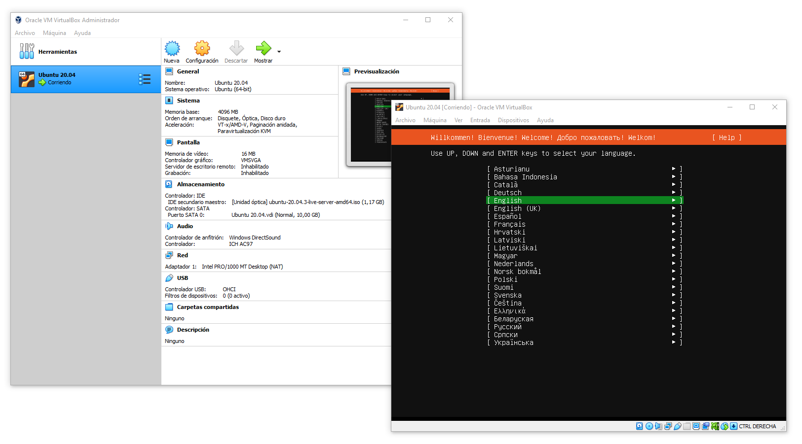
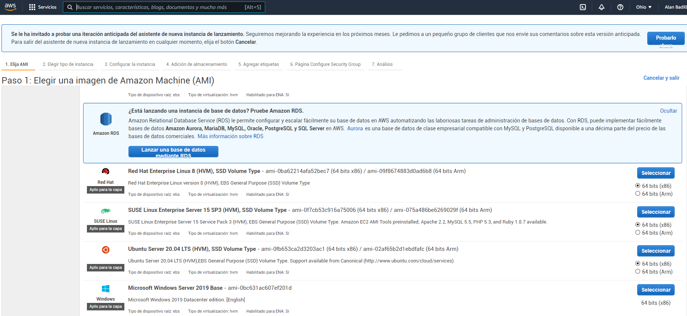
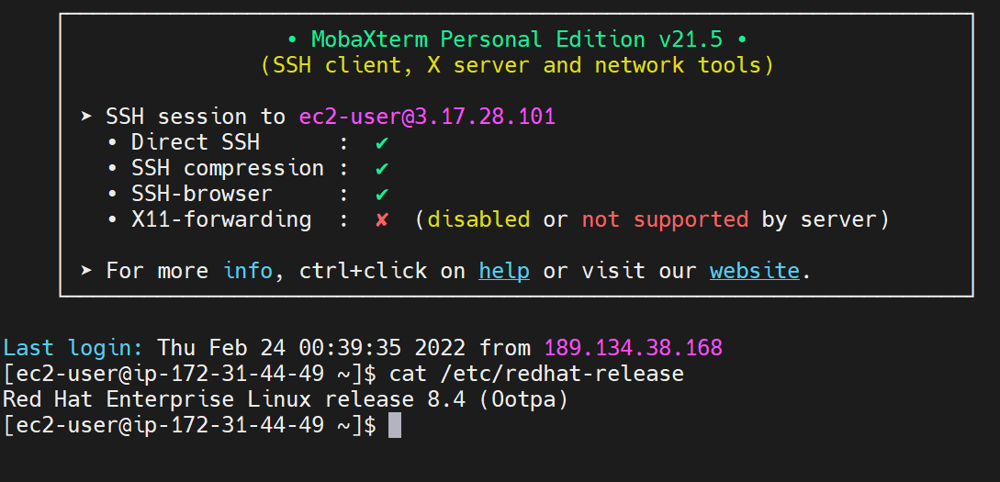

# Sesión 1 - Seguridad y Usuarios

## Agenda

* Linux y entornos virtuales

    - Configuración de un entorno virtual Linux
    - Introducción a RHEL (Red Hat Enterprise Linux)
    - Introducción a Ubuntu
    - Configuración de un Servidor Amazon Linux

* Seguridad en Cuentas de Usuarios y Grupos

    - Usuarios administrativos
    - El grupo predefinido admin
    - El archivo de políticas sudo
    - Usuarios sudo limitados
    - Prevención de ataques de fuerza bruta en contraseñas
    - Bloquear de cuentas de usuarios

* Seguridad del Servidor y el Firewall

    - Introducción a iptables
    - Zonas y servicios
    - Introducción a nftables

## Introducción

Los sistemas basados en Linux son muy utilizados en la industría, debido a su naturaleza Open Source, su comunidad activa y los miles de paquetes optimizados para robustecer un Sistema Operativo seguro y productivo.

Dentro de Linux existen diversas distribuciones como `Debian/Ubuntu`, `Red Hat/CentOS/Fedora/RHEL`, `Suse`, `Arch`, entre muchas otras. Cada distribución posee características únicas en el comportamiento interno de Linux, cómo el gestor de paquetes utilizado para extender las capacidades de software, la estructura de archivos y servicios principales disponibles, políticas de seguridad y reglas de administración en general.

Sin embargo, independiente de la arquitectura, hay un conjunto de herramientas y técnicas que nos permiten asegurar el buen funcionamiento de Linux, el control de accesos de usuarios, las reglas de configuración de peticiones TCP, el cifrado de los discos, carpetas y archivos y la auditoría en directorios, archivos y llamadas al sistema operativo.

En esta sesión aprenderemos a configurar un sistema basado en Linux usando las distribuciones de Ubuntu y Red Hat Enterprise Linux (RHEL) para en lo siguiente aprender a administrar de forma segura a ambos. También veremos como configurar usuarios y grupos, limitar a usuarios administradores tipo `sudo` y el manejo de seguridad en el *firewall* con `iptables` y `nftables`.

## Linux y entornos virtuales

    - Configuración de un entorno virtual Linux
    - Introducción a RHEL (Red Hat Enterprise Linux)
    - Introducción a Ubuntu
    - Configuración de un Servidor Amazon Linux

### Configuración de un entorno virtual Linux

Una forma rápida y segura de probar sistemas linux e interactuar con ellos, es creando *Entornos Virtuales de Linux*. Los cuáles podrán ser ejecutados dentro de otros ambientes como Windows, Linux y Mac. Esto nos permitirá aislar el entorno virtual y establecer restricciones en el uso del CPU, la memoria, la red y capacidad de almacenamiento. 

Podemos crear entornos virtuales de linux mediante herramientas como [VirtualBox](https://www.virtualbox.org), aunque también existen más alternativas.

> Proceso para configurar un entorno virtual

    1. Instalar una herramienta de virtualización como Virtual Box
    2. Descargar una imagen de alguna distribución de Linux
    3. Configurar una nueva máquina virtual para el sistema operativo objetivo
    4. Configurar el CPU, Memoria, Red y Disco de la máquina virtual
    5. Iniciar la Máquina Virtual seleccionando la imagen de linux
    6. Instalar la distribución de linux elegida para nuestra máquina

En la siguiente imagen podemos observar una nueva imagen de linux en Virtual Box siendo instalada.

### Introducción a RHEL (Red Hat Enterprise Linux)

La distribución [Red Hat Enterprise Linux](https://www.redhat.com/es/enterprise-linux-8) de *RedHat*, es una de las más populares dentro de la industría, debido a sus capacidades sobre Cloud Computing y demás características Enterprise disponibles bajo las licencias establecidas. Al ser una distribución de Linux comercial, cuenta con gran soporte y una empresa de respaldo que invierte fuertes sumas en seguridad y características superiores a cualquier distribución tradicional de Linux. Esta es una gran alternativa para empresas y corporativos.

La gestión de paquetes en *RHEL* se puede lograr mediante el gestor de paquetes *YUM* o directamente con el adminstrador de paquetes *RPM* (*RedHat Package Manager*). El administrador de paquetes principal es *RPM* y *YUM* será un gestor que facilite el uso del administrador de paquetes *RPM*.

A continuación revisaremos algunos comandos esenciales para el control de paquetes en *RHEL*.

> Instalar paquetes a través de `yum`

    [rhel]$ sudo yum install python3

> Ver paquetes instalados con `rpm -qa`

    [rhel]$ rpm -qa

    # Filtrar los paquetes que contengan `python3`

    [rhel]$ rpm -qa | grep python3

    --- SALIDA ---
    
    python3-unbound-1.7.3-15.el8.x86_64
    python3-libsemanage-2.9-6.el8.x86_64
    python3-pyudev-0.21.0-7.el8.noarch
    ...

> Obtener la información de un paquete con `rpm -qi <package>`

    [rhel]$ rpm -qi python36-*

    --- SALIDA ---

    Name        : python36
    Version     : 3.6.8
    Release     : 38.module+el8.5.0+12207+5c5719bc
    Architecture: x86_64
    Install Date: Thu 24 Feb 2022 12:43:24 AM UTC
    Group       : Unspecified
    Size        : 13131
    License     : Python
    Signature   : RSA/SHA256, Mon 23 Aug 2021 02:43:51 PM UTC, Key ID 199e2f91fd431d51
    Source RPM  : python36-3.6.8-38.module+el8.5.0+12207+5c5719bc.src.rpm
    Build Date  : Wed 11 Aug 2021 10:56:38 AM UTC
    Build Host  : x86-vm-14.build.eng.bos.redhat.com
    Relocations : (not relocatable)
    Packager    : Red Hat, Inc. <http://bugzilla.redhat.com/bugzilla>
    Vendor      : Red Hat, Inc.
    URL         : https://www.python.org/
    Summary     : Interpreter of the Python programming language
    Description :
    Python is an accessible, high-level, dynamically typed, interpreted programming
    language, designed with an emphasis on code readibility.
    It includes an extensive standard library, and has a vast ecosystem of
    third-party libraries.

    ...

> Ver la lista de ficheros asociados a un paquete con `rpm -ql <package>`

    [rhel]$ rpm -ql python36-3.6.*

    --- SALIDA ---

    /usr/bin/easy_install-3
    /usr/bin/pip-3
    /usr/bin/pip3
    /usr/bin/pydoc-3
    /usr/bin/pydoc3
    /usr/bin/python3
    /usr/bin/python3.6
    /usr/bin/python3.6m
    /usr/bin/pyvenv-3
    /usr/bin/unversioned-python
    /usr/share/doc/python36
    /usr/share/doc/python36/README
    /usr/share/licenses/python36
    /usr/share/licenses/python36/LICENSE
    ...

> Ver la lista de ficheros de configuración de un paquete con `rpm -qc <package>`

    [rhel]$ rpm -qc bash

    --- SALIDA ---

    /etc/skel/.bash_logout
    /etc/skel/.bash_profile
    /etc/skel/.bashrc

> Listar los paquetes instalados con yum usando `yum list --installed`

    [rhel]$ yum list --installed | grep python3

    --- SALIDA ---

    python3-audit.x86_64        3.0-0.17...     @anaconda
    python3-babel.noarch        2.5.1-5.el8     @koji-override-1
    python3-cffi.x86_64         1.11.5-5.el8    @anaconda
    python3-chardet.noarch      3.0.4-7.el8     @anaconda
    python3-configobj.noarch    5.0.6-11.el8    @anaconda
    ...

> Desisntalar un paquete con `rpm -e <package>` y `yum remove <package>`

    [rhel]$ sudo yum remove python36.x86_64

    --- SALIDA ---

    Dependencies resolved.
    ==================================================================================================================================================
    Package                       Architecture      Version                                             Repository                              Size
    ==================================================================================================================================================
    Removing:
    python36                      x86_64            3.6.8-38.module+el8.5.0+12207+5c5719bc              @rhel-8-appstream-rhui-rpms             13 k
    Removing unused dependencies:
    python3-pip                   noarch            9.0.3-19.el8                                        @rhel-8-appstream-rhui-rpms            2.8 k
    python3-setuptools            noarch            39.2.0-6.el8                                        @rhel-8-baseos-rhui-rpms               450 k

    Transaction Summary
    ==================================================================================================================================================
    Remove  3 Packages

    Freed space: 466 k
    Is this ok [y/N]:

### Introducción a Ubuntu

La distribución de [Ubuntu](https://ubuntu.com) de *Canoical*, es una de las más populares a nivel usuario, por su facilidad de uso y gran soporte de paquetes, gracias a que está basada en [Debian](https://www.debian.org). Una de las principales características que le diferencias de otras distribuciones no comerciales, es el amplio soporte dado por *Canonical* y es una gran alternativa a infraestructuras no comerciales para empresas medianas y gobiernos.

La administración y gestión de paquetes en *Ubuntu* puede lograrse mediante *APT* (*Advanced Package Tool*) y *DPKG*.

A continuación revisaremos algunos comandos esenciales para el control de paquetes en *Ubuntu*.

> Actualizar el índice de paquetes con `apt update`

    [ubuntu]$ sudo apt update

    --- SALIDA ---

    Hit:1 http://mx.archive.ubuntu.com/ubuntu focal InRelease
    Hit:2 http://mx.archive.ubuntu.com/ubuntu focal-updates InRelease
    Hit:3 http://mx.archive.ubuntu.com/ubuntu focal-backports InRelease
    Hit:4 http://mx.archive.ubuntu.com/ubuntu focal-security InRelease
    Reading package lists... Done
    Building dependency tree
    Reading state information... Done
    44 packages can be upgraded. Run 'apt list --upgradable' to see them.

> Listar los paquetes actualizables

    [ubuntu]$ apt list --upgradable

    --- SALIDA ---

    Listing... Done
    alsa-ucm-conf/focal-updates 1.2.2-1ubuntu0.11 all [upgradable from: 1.2.2-1ubuntu0.9]
    base-files/focal-updates 11ubuntu5.5 amd64 [upgradable from: 11ubuntu5.4]
    cloud-init/focal-updates 21.4-0ubuntu1~20.04.1 all [upgradable from: 21.2-3-g899bfaa9-0ubuntu2~20.04.1]
    ...

> Actualizar los paquetes instalados con `apt upgrade`

    # Listar los paquetes actualizables

    [ubuntu]$ apt list --upgradable

    # Actualizar todos los paquetes

    [ubuntu]$ sudo apt upgrade
    
    # Actualizar un paquete en específico

    [ubuntu]$ sudo apt upgrade <package>

    # Instalar versión más reciente de un paquete

    [ubuntu]$ sudo apt install --only-upgrade <package>

> Instalar nuevos paquetes con `apt install <package>`

    [ubuntu]$ sudo apt install <package>

    # Instalar múltiples paquetes

    [ubuntu]$ sudo apt install <package 1> <package 2> ...

    # Instalar desde un archivo `.deb`

    sudo apt install <path>/<file>.deb

> Ver la información de un paquete con `apt show <package>`

    [ubuntu]$ apt show python3

    --- SALIDA ---

    Package: python3
    Version: 3.8.2-0ubuntu2
    Priority: important
    Section: python
    Source: python3-defaults
    Origin: Ubuntu
    Maintainer: Ubuntu Developers <ubuntu-devel-discuss@lists.ubuntu.com>
    Original-Maintainer: Matthias Klose <doko@debian.org>
    Bugs: https://bugs.launchpad.net/ubuntu/+filebug
    Installed-Size: 194 kB
    Provides: python3-profiler
    Pre-Depends: python3-minimal (= 3.8.2-0ubuntu2)
    Depends: python3.8 (>= 3.8.2-1~), libpython3-stdlib (= 3.8.2-0ubuntu2)
    Suggests: python3-doc (>= 3.8.2-0ubuntu2), python3-tk (>= 3.8.2-1~), python3-venv (>= 3.8.2-0ubuntu2)
    Replaces: python3-minimal (<< 3.1.2-2)
    Homepage: https://www.python.org/
    Task: minimal, ubuntu-core
    Download-Size: 47.6 kB
    APT-Manual-Installed: no
    APT-Sources: http://mx.archive.ubuntu.com/ubuntu focal/main amd64 Packages
    Description: interactive high-level object-oriented language (default python3 version)
    Python, the high-level, interactive object oriented language,
    includes an extensive class library with lots of goodies for
    network programming, system administration, sounds and graphics.
    ...

> Ver los archivos de un paquete con `dpkg -L <package>`

    [ubuntu]$ dpkg -L python3

    --- SALIDA ---
    /.
    /usr
    /usr/bin
    /usr/lib
    /usr/lib/valgrind
    /usr/lib/valgrind/python3.supp
    /usr/share
    /usr/share/doc
    /usr/share/doc/python3
    /usr/share/doc/python3/copyright
    /usr/share/doc/python3/python-policy.dbk.gz
    /usr/share/doc/python3/python-policy.html
    /usr/share/doc/python3/python-policy.html/build_dependencies.html
    /usr/share/doc/python3/python-policy.html/embed.html
    /usr/share/doc/python3/python-policy.html/index.html
    /usr/share/doc/python3/python-policy.html/module_packages.html
    /usr/share/doc/python3/python-policy.html/other.html
    /usr/share/doc/python3/python-policy.html/packaging_tools.html
    /usr/share/doc/python3/python-policy.html/programs.html
    /usr/share/doc/python3/python-policy.html/python.html
    /usr/share/doc/python3/python-policy.html/python3.html
    /usr/share/doc/python3/python-policy.html/upgrade.html
    /usr/share/doc/python3/python-policy.txt.gz
    /usr/share/doc/python3.8
    ...

> Ver los archivos de configuración de un paquete

    [ubuntu]$ ls /var/lib/dpkg/info/*.conffiles | grep bash

    --- SALIDA ---

    /var/lib/dpkg/info/bash-completion.conffiles
    /var/lib/dpkg/info/bash.conffiles

    # Ver el contenido de los archivos

    [ubuntu]$ cat $(ls /var/lib/dpkg/info/*.conffiles | grep bash)

    --- SALIDA ---

    /etc/bash_completion
    /etc/profile.d/bash_completion.sh
    /etc/bash.bashrc
    /etc/skel/.bash_logout
    /etc/skel/.bashrc
    /etc/skel/.profile

> Eliminar paquetes paquetes con `apt remove <package>`

    [ubuntu]$ sudo apt remove python3

    # Eliminar también los archivos residuales

    [ubuntu]$ sudo apt purge <package>

### Configuración de un Servidor Amazon Linux

[Amazon](https://aws.amazon.com/es/ec2/) provee un conjunto de arquitecturas e infraestructura basadas en la nube y el *Cómputo en la Nube* que permiten configurar rápidamente servidores basados en diversas distribuciones de Windows y Linux de forma sencilla.

Una de las principales características es que configura las mínimas reglas de seguridad para brindar servidores seguros.

Al configurar un servidor de Amazon podemos elegir el tipo de servidor, si será virtual o dedicado y también la ubicación, distribución y demás aspectos.

En la siguiente imagen se muestra la interfaz para el lanzamiento de nuevas instancias tipo Amazon EC2 listas para la producción.

Durante la configuración de la instancia podremos crear un archivo de claves `.pem` para conectarnos a las nuevas instancias. Para hacerlo bastará crear una conexión remota *SSH* y apuntar a la IP asignada de la instancia, el usuario por defecto para la distribución y el archivo `.pem` creado.

> Conectar una instancia vía SSH de Amazon EC2

    [host]$ ssh -i "<path>/<file>.pem" <user>@<ip>

    # <path> - Ruta hacía el archivo .pem
    # <file> - Nombre del archivo .pem
    # <user> - Nombre del usuario por defecto
    # <ip>   - IP, Host o DNS de la instancia

En la siguiente imagen se observa la conexión vía SSH desde [MobaXterm](https://mobaxterm.mobatek.net).

## Seguridad en Cuentas de Usuarios y Grupos

    - Usuarios administrativos
    - El grupo predefinido admin
    - El archivo de políticas sudo
    - Usuarios sudo limitados
    - Prevención de ataques de fuerza bruta en contraseñas
    - Bloquear de cuentas de usuarios

### Usuarios administrativos

Por defecto algunas distribuciones como *RHEL* o *CentOS* dejan activo un usuario `root` único del sistema, con la contraseña establecida en la instalación.

Usar el usuario `root` es peligroso y crea vulnerabilidades, por lo que su acceso debe ser deshabilitado lo antes posible. Sin embargo, antes debemos crear usuarios administrativos para no romper el acceso administrativo al sistema.

En *RHEL/CentOS* tenemos un grupo de usuarios administrativos por defecto llamado `wheel`, en *Debian/Ubuntu* tenemos el grupo llamado `sudo`.

Los usuarios que estén dentro del grupo administrativo serán administradores del sistema y podrán ejecutar comandos basados en las políticas de seguridad establecidas.

El primer archivo que debe ser familiar para cualquier administrador es `/etc/sudoers` administrado a través del comando `visudo`.

* **Nota:** No se debe modificar el archivo `/etc/sudoers` manualmente, ya que podría ocasionar errores graves.

> Abrir el archivo de políticas de seguridad con `visudo`

    [linux]# visudo

    [linux]$ sudo visudo

    --- SALIDA [CENTOS] ---

    ...
    ## Allow root to run any commands anywhere
    root    ALL=(ALL)       ALL

    ## Allows members of the 'sys' group to run networking, software,
    ## service management apps and more.
    # %sys ALL = NETWORKING, SOFTWARE, SERVICES, STORAGE, DELEGATING, PROCESSES, LOCATE, DRIVERS

    ## Allows people in group wheel to run all commands
    %wheel  ALL=(ALL)       ALL
    ...

    --- SALIDA [UBUNTU] ---

    ...
    # User privilege specification
    root    ALL=(ALL:ALL) ALL

    # Members of the admin group may gain root privileges
    %admin ALL=(ALL) ALL

    # Allow members of group sudo to execute any command
    %sudo   ALL=(ALL:ALL) ALL
    ...

En este archivo podremos establecer las políticas de seguridad para grupos y usuarios, cómo se verá más adelante en estas notas.

### El grupo predefinido admin

En *RHEL/CentOS* el grupo de administradores por defecto es llamado `wheel`, mientras que en *Debian/Ubuntu* es llamado `sudo`. Sin embargo, en ambas distribuciones en modo `su` (usuario `root`), podemos observar sólo el grupo `root`.

> Ver los grupos del usuario con `groups`

    [linux]# groups

    --- SALIDA--

    root

    [linux]$ groups

    --- SALIDA [CENTOS] ---

    demo wheel

    --- SALIDA [UBUNTU] ---

    demo sudo

Podemos agregar nuevos usuarios mediante `useradd`, especificando opcionalmente su grupo, su carpeta *HOME* y la terminal usada. Si el grupo no existe previamente, este será creado automáticamente, si no se especifica su nombre será igual que el nombre del usuario. Si la carpeta *HOME* no se establece, este usuario no tendrá carpeta principal. Y si la terminal no se estable se usará la terminal `/bin/sh`.

> Agregar un usuario nuevo con `useradd [options] <user>`

    [linux]# useradd demo

    # Con grupo explícito

    [linux]# useradd -G demo demo

    # Con carpeta HOME y terminal bash

    [linux]# useradd -m -d /home/demo -s /bin/bash demo

    # Con grupo administrador, carpeta HOME y terminal bash

    [linux]# useradd -G sudo -m -d /home/demo -s /bin/bash demo

Una vez creado el usuario, podemos reemplazar el grupo al que pertenece el usuario o agregar nuevos grupos para el usuario.

> Actualizar el grupo del usuario con `usermod [options] <user>`

    # Cambiar el grupo del usuario `demo` a `admin`

    [linux]# usermod -G admin demo

    # Agregar el grupo `test` al usuario `demo` sin quitar los previos

    [linux]# usermod -a -G admin demo

    # Establecer la carpeta principal del usuario `demo` y su terminal

    [linux]# usermod -m -d /home/demo -s /bin/bash demo

Observa que el uso de `usermod` es similar a `useradd`, sin embargo, este sólo modificará al usuario. Esto es útil cuándo volvemos a llamar `useradd` con otros parámetros podría indicarnos que el usuario ya existe y no realizará los cambios.

También podemos borrar al usuario mediante `userdel`.

> Borrar un usuario con `userdel [options] <user>`
    
    [linux]# userdel demo

    # Borrar también su directio HOME (CUIDADO)

    [linux]# userdel -r demo

Para revisar la lista de los usuarios podemos revisar el archivo `/etc/passwd`.

> Ver los usuarios en `/etc/passwd`

    [linux]# cat /etc/passwd

    --- SALIDA ---
    ubuntu:x:1000:1000:Ubuntu Admin:/home/ubuntu:/bin/bash
    ...
    demo:x:1001:1001::/home/demo:/bin/bash
    ...

    # Filtrar el usuario objetivo

    [linux]# cat /etc/passwd | grep demo

    >>> demo:x:1001:1001::/home/demo:/bin/bash

El resultado será una cadena compuesta como sigue:

    <user>:<encrypt>:<uid>:<gid>:<fullname>:<home>:<shell>

    # <user>     - El nombre del usuario
    # <encrypt>  - Tipo de encriptación (x - contraseña en `/etc/shadow`)
    # <uid>      - El ID del usuario (UID)
    # <gid>      - El ID del grupo (GID)
    # <fullname> - El nombre completo (GECOS)
    # <home>     - La ruta de la carpeta principal (HOME)
    # <shell>    - La ruta a la terminal principal (SHELL)

Una vez creado el usuario, podemos establecer una contraseña mediante `passwd`. El usuario `root` siempre podrá cambiar la contraseña de cualquier usuario.

> Establecer la contraseña para un usuario con `passwd <user>`

    [linux]# passwd demo

Una vez que el usuario tenga una contraseña, podremos iniciar sesión con él mediante `su - <user>`.

> Iniciar sesión con otro usuario

    # Consultar el usuario actual

    [linux]$ whoami

    >>> ubuntu

    # Iniciar sesión con el usuario `demo`

    [linux]$ su - demo
    Password:

    # Consultar el usuario actual

    [linux]$ whoami

    >>> demo

    # Terminar la sesión del usuario actual

    [linux]$ exit

    # Consultar el usuario actual

    [linux]$ whoami

    >>> ubuntu

También podemos deshabilitar el uso de la contraseña de un usuario, para impedirle el inicio de sesión. Esto lo veremos más a detalle en estas mismas notas.

> Habilitar/Deshabilitar la contraseña de un usuario

    # Deshabilitar el uso de contraseña para el usuario `demo`

    [linux]# passwd -l demo

    # Habilitar el uso de contraseña para el usuario `demo`

    [linux]# passwd -u demo

* **Nota:** En *RHEL/CentOS* es común que cuándo los usuarios administradores queden establecidos, se deshabilite el uso de contraseña para el usuario `root`. En *Debian/Ubuntu* el usuario `root` suele estar ya deshabilitado para su inicio de sesión, sin embargo, podemos acceder a él mediante `sudo su`.

### El archivo de políticas sudo

Mediante `visudo` podemos acceder al archivo de políticas de seguridad, el cuál establecerá cuáles son las políticas a seguir para grupos y usuarios. Podemos, por ejemplo, establecer que cómandos serán capaces de ejecutar qué grupos, qué usuarios o qué conjuntos de usuarios específicos (conjuntos de usuarios de distintos grupos quizás).

El archivo `/etc/sudoers` contendrá las políticas de seguridad para los usuarios administradores. Este debe ser editado a través de `visudo` para evitar un mal manejo del archivo.

Dentro de este archivo podemos establecer conjuntos de usuarios (`User_Alias`) u otorgar permisos individuales a usuarios. Sin embargo, es recomendable trabajar los permisos sobre los *grupos de usuarios* o los *conjuntos de usuarios*.

> Crear un Conjunto de Usuarios con `User_Alias`

    [linux]# visudo

    ---
    # Conjunto de usuarios ADMINS
    User_Alias ADMINS = john, ana

    # Políticas sobre el conjunto de usuarios
    ADMINS ALL=(ALL) ALL

    # Políticas sobre un usuario específico (no recomendado)
    pedro ALL=(ALL) ALL
    ---

### Usuarios sudo limitados

Muchas veces necesitaremos otorgar privilegios específicos a usuarios, conjuntos de usuarios o grupos.

Por ejemplo, para un servidor, podríamos planear políticas de seguridad para usuarios administradores de paquetes, administradores de servicios o administradores específicos sobre comandos personalizados.

Mediante el conjunto de comandos (`Cmnd_Alias`) podemos establecer el alcance de los comandos `sudo` que podrán ejecutar los usuarios.

> Establecer un conjunto de comandos con `Cmnd_Alias`

    [linux]# visudo

    ---
    # Conjunto de comandos
    Cmnd_Alias SOFTWARE = /bin/rpm, /usr/bin/yum, /usr/bin/systemctl status *

    # Conjunto de usuarios
    User_Alias SOFTWAREADMINS = susy, sara

    # Políticas sobre el conjunto de usuarios
    SOFTWAREADMINS ALL=(ALL) SOFTWARE
    ---

* **Nota:** Los grupos se diferencian de los usuarios mediante el `%` como prefijo, por ejemplo, `%demo` significa el grupo de usuarios `demo`. Recordando que este grupo se ajustó al usuario mediante `useradd -G demo` o `usermod -a demo`. El prefijo `+` será para grupos de red, el prefijo `!` será usado para excluir usuarios dentro del grupo o conjunto (ejemplo un nuevo conjunto de administradores sin ciertos usuarios `User_Alias SOFTWAREDMINS = ADMINS, !pepe, !paco`). Finalmente el prefijo `#` marca un `UID` dentro de `Runas_Alias` (ejemplo `Runas_Alias ROOT = #0`).

> Sintaxis de la Política de Seguridad

    <user> <host>=(<account>) [<tag>] <command>

    # <user>    - El usuario o conjunto de usuarios/grupos
    # <host>    - El servidor o conjunto de servidores/direcciones
    # <account> - El usuario o conjuto de usuarios que ejecutarán los comandos (Se usará `sudo -u <account>`)
    # <tag>     - La etiqueta opcional si requiere o no contraseña (`PASSWD` o `NOPASSWD`)
    # <command> - El comando o conjunto de comandos que serán ejecutados

Finalmente podemos establecer el tiempo que tendrán los usuarios para reingresar la contraseña (por defecto 5 minutos).

> Establecer el tiempo para solicitar nuevamente la contraseña con `Defaults[:<user>] timestamp_timeout <time>`

    # Solicita la contraseña inmediatamente
    Defaults timestamp_timeout = 0

    # Solicita la contraseña tras 10 minutos para el usuario `ana`
    Defaults:ana timestamp_timeout = 10

    # Omite la autenticación para el usuario `pedro`
    Defaults:pedro !authenticate

[REFERENCIAS]

* [https://help.ubuntu.com/community/Sudoers](https://help.ubuntu.com/community/Sudoers)
* [https://www.sudo.ws/docs/man/1.8.15/sudoers.man/](https://www.sudo.ws/docs/man/1.8.15/sudoers.man/)

### Prevención de ataques de fuerza bruta en contraseñas

Podemos usar el módulo `pam_tally2` instalado por defecto en *Debian/Ubuntu* o `faillock` en *RHEL/CentOS*, para bloquear los accesos por contraseña, cuándo está alcance un límite de intentos. A través del archivo `/etc/pam.d/login` podemos agregar las instrucciones necesarias para `deny=<intents>`. Esto prevendrá que los usuarios sigan estableciendo contraseñas no válidas, cuándo se alacanzó el máximo de intentos.

[UBUNTU]

> Editar el archivo `/etc/pam.d/login` y ubicar el comentario con `TTY` o `pam_selinux.so`

    [ubuntu]$ sudo nano /etc/pam.d/login

    # SELinux needs to intervene at login time to ensure that the process
    # starts in the proper default security context. Only sessions which are
    # intended to run in the user's context should be run after this.
    # pam_selinux.so changes the SELinux context of the used TTY and configures
    # SELinux in order to transition to the user context with the next execve()
    # call.
    session [success=ok ignore=ignore module_unknown=ignore default=bad] pam_selinux.so open
    # When the module is present, "required" would be sufficient (When SELinux
    # is disabled, this returns success.)

    # >>> ESTABLECER EL MÁXIMO DE INTENTOS Y EL TIEMPO DE DESBLOQUEO
    auth required pam_tally2.so deny=4 even_deny_root unlock_time=60

> Ver los intentos fallidos mediante `pam_tally2 [--user=<user>]`

    [ubuntu]$ sudo pam_tally2

    --- SALIDA ---

    Login           Failures Latest failure     From
    demo                8    02/24/22 07:55:25

> Reiniciar un bloqueo mediante `sudo pam_tally2 --user=<user> --reset`

    [ubuntu]$ sudo pam_tally2 --user=demo --reset

[CentOS]

> Editar los archivos `/etc/pam.d/password-auth` y `/etc/pam.d/system-auth` antes y después de `pam_unix.so`

    [rhel]# nano /etc/pam.d/password-auth

    auth        required                                     pam_env.so
    ...
    auth        required                                     pam_faillock.so audit deny=3 unlock_time=60
    auth        sufficient                                   pam_unix.so nullok
    auth        [default=die] pam_faillock.so                authfail audit deny=3 unlock_time=60
    ...

    account     required                                     pam_faillock.so

    [rhel]# nano /etc/pam.d/system-auth

    auth        required                                     pam_env.so
    ...
    auth        required                                     pam_faillock.so audit deny=3 unlock_time=60
    auth        sufficient                                   pam_unix.so nullok
    auth        [default=die] pam_faillock.so                authfail audit deny=3 unlock_time=60
    ...

    account     required                                     pam_faillock.so
 
> Ver los intentos fallidos mediante `faillock [--user=<user>]`

    [rhel]# faillock 

    --- SALIDA ---

    demo:
    When                Type  Source                                           Valid
    2022-02-24 03:29:52 TTY   tty1                                                 V
    2022-02-24 03:24:29 TTY   tty1                                                 I
    2022-02-24 03:24:40 TTY   tty1                                                 I
    2022-02-24 03:28:41 TTY   tty1                                                 I
    2022-02-24 03:28:50 TTY   tty1                                                 I

> Reiniciar un bloqueo mediante `sudo faillock --user=<user> --reset`

    [rhel]# faillock --user=demo --reset

### Bloquear de cuentas de usuarios

Podemos considerar bloquear usuarios o contraseñas cuándo queramos inactivar temporalmente a los mismos. Por ejemplo, en el caso de un administrador que esté de vacaciones o suspendido.

Para lograrlo podemos usar los comandos `usermod -L <user>` para bloquear al usuario o `passwd -l <user>` para bloquear su contraseña. Ambos comandos tienen el mismo sentido de impedir su acceso. Para desbloquearlos podemos usar `usermod -U <user>` o `passwd -u <user>`.

El efecto de bloquear un usuario será que en el archivo `/etc/shadow` se antepondrá un `!` antes de la contraseña del usuario, indicando que el usuario está bloqueado.

> Bloquear usuarios

    # Bloquear al usuario `demo` mediante `usermod`

    [linux]# usermod -L demo

    # Bloquear al usuario `demo` mediante `passwd`

    [linux]# passwd -l demo

> Desbloquar usuarios

    # Desbloquear al usuario `demo` mediante `usermod`

    [linux]# usermod -L demo

    # Desbloquear al usuario `demo` mediante `passwd`

    [linux]# passwd -l demo

* **Nota:** Puedes usar `crontab` para programar bloqueos y desbloqueos automáticos de usuarios. Esto sería útil para horarios laborales o de mantenimiento programados.

## Seguridad del Servidor y el Firewall

    - Introducción a iptables
    - Zonas y servicios
    - Introducción a nftables

---

 Por [Alan Badillo Salas](https://github.com/dragonnomada)

Estudié **Matemáticas Aplicadas** en la Universidad Autónoma Metropolitana, posteriormente realicé una Maestría en **Inteligencia Artificial** en el Instituto Politécnico Nacional.

He impartido cursos de Programación Avanzada en múltiples lenguajes de programación, incluyendo *C/C++, C#, Java, Python, Javascript* y plataformas como *Android, IOS, Xamarin, React, Vue, Angular, Node, Express*. Ciencia de Datos en *Minería de Datos, Visualización de Datos, Aprendizaje Automático y Aprendizaje Profundo*. También sobre *Sistemas de administración basados en Linux, Apache, Nignx* y *Bases de Datos SQL y NoSQL* como MySQL, SQL Server y Mongo. Desde hace 7 años en varios instituciones incluyendo el *IPN-CIC, KMMX, The Inventor's House, Auribox*. Para diversos clientes incluyendo al **INEGI, CFE, PGJ, SEMAR, Universities, Oracle, Intel y Telmex**.