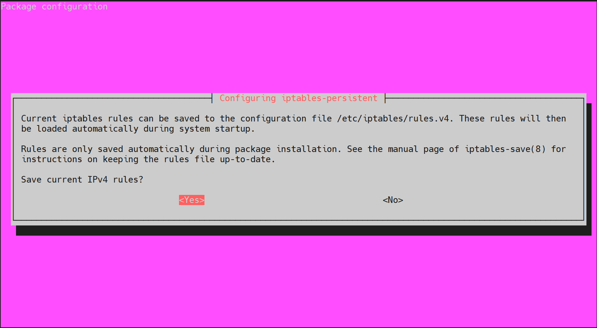

# Sesión 1 - Seguridad, Usuarios y Firewall

## Agenda

* Linux y entornos virtuales

    - Configuración de un entorno virtual Linux
    - Introducción a RHEL (Red Hat Enterprise Linux)
    - Introducción a Ubuntu
    - Configuración de un Servidor Amazon Linux

* Seguridad en Cuentas de Usuarios y Grupos

    - Usuarios administrativos
    - El grupo predefinido admin
    - El archivo de políticas sudo
    - Usuarios sudo limitados
    - Prevención de ataques de fuerza bruta en contraseñas
    - Bloquear de cuentas de usuarios

* Seguridad del Servidor y el Firewall

    - Introducción a iptables
    - Zonas y servicios
    - Introducción a nftables

## Introducción

Los sistemas basados en Linux son muy utilizados en la industría, debido a su naturaleza Open Source, su comunidad activa y los miles de paquetes optimizados para robustecer un Sistema Operativo seguro y productivo.

Dentro de Linux existen diversas distribuciones como `Debian/Ubuntu`, `Red Hat/CentOS/Fedora/RHEL`, `Suse`, `Arch`, entre muchas otras. Cada distribución posee características únicas en el comportamiento interno de Linux, cómo el gestor de paquetes utilizado para extender las capacidades de software, la estructura de archivos y servicios principales disponibles, políticas de seguridad y reglas de administración en general.

Sin embargo, independiente de la arquitectura, hay un conjunto de herramientas y técnicas que nos permiten asegurar el buen funcionamiento de Linux, el control de accesos de usuarios, las reglas de configuración de peticiones TCP, el cifrado de los discos, carpetas y archivos y la auditoría en directorios, archivos y llamadas al sistema operativo.

En esta sesión aprenderemos a configurar un sistema basado en Linux usando las distribuciones de Ubuntu y Red Hat Enterprise Linux (RHEL) para en lo siguiente aprender a administrar de forma segura a ambos. También veremos como configurar usuarios y grupos, limitar a usuarios administradores tipo `sudo` y el manejo de seguridad en el *firewall* con `iptables` y `nftables`.

## Linux y entornos virtuales

    - Configuración de un entorno virtual Linux
    - Introducción a RHEL (Red Hat Enterprise Linux)
    - Introducción a Ubuntu
    - Configuración de un Servidor Amazon Linux

### Configuración de un entorno virtual Linux

Una forma rápida y segura de probar sistemas linux e interactuar con ellos, es creando *Entornos Virtuales de Linux*. Los cuáles podrán ser ejecutados dentro de otros ambientes como Windows, Linux y Mac. Esto nos permitirá aislar el entorno virtual y establecer restricciones en el uso del CPU, la memoria, la red y capacidad de almacenamiento. 

Podemos crear entornos virtuales de linux mediante herramientas como [VirtualBox](https://www.virtualbox.org), aunque también existen más alternativas.

> Proceso para configurar un entorno virtual

    1. Instalar una herramienta de virtualización como Virtual Box
    2. Descargar una imagen de alguna distribución de Linux
    3. Configurar una nueva máquina virtual para el sistema operativo objetivo
    4. Configurar el CPU, Memoria, Red y Disco de la máquina virtual
    5. Iniciar la Máquina Virtual seleccionando la imagen de linux
    6. Instalar la distribución de linux elegida para nuestra máquina

En la siguiente imagen podemos observar una nueva imagen de linux en Virtual Box siendo instalada.

### Introducción a RHEL (Red Hat Enterprise Linux)

La distribución [Red Hat Enterprise Linux](https://www.redhat.com/es/enterprise-linux-8) de *RedHat*, es una de las más populares dentro de la industría, debido a sus capacidades sobre Cloud Computing y demás características Enterprise disponibles bajo las licencias establecidas. Al ser una distribución de Linux comercial, cuenta con gran soporte y una empresa de respaldo que invierte fuertes sumas en seguridad y características superiores a cualquier distribución tradicional de Linux. Esta es una gran alternativa para empresas y corporativos.

La gestión de paquetes en *RHEL* se puede lograr mediante el gestor de paquetes *YUM* o directamente con el adminstrador de paquetes *RPM* (*RedHat Package Manager*). El administrador de paquetes principal es *RPM* y *YUM* será un gestor que facilite el uso del administrador de paquetes *RPM*.

A continuación revisaremos algunos comandos esenciales para el control de paquetes en *RHEL*.

> Instalar paquetes a través de `yum`

    [rhel]$ sudo yum install python3

> Ver paquetes instalados con `rpm -qa`

    [rhel]$ rpm -qa

    # Filtrar los paquetes que contengan `python3`

    [rhel]$ rpm -qa | grep python3
    
    python3-unbound-1.7.3-15.el8.x86_64
    python3-libsemanage-2.9-6.el8.x86_64
    python3-pyudev-0.21.0-7.el8.noarch
    ...

> Obtener la información de un paquete con `rpm -qi <package>`

    [rhel]$ rpm -qi python36-*

    Name        : python36
    Version     : 3.6.8
    Release     : 38.module+el8.5.0+12207+5c5719bc
    Architecture: x86_64
    Install Date: Thu 24 Feb 2022 12:43:24 AM UTC
    Group       : Unspecified
    Size        : 13131
    License     : Python
    Signature   : RSA/SHA256, Mon 23 Aug 2021 02:43:51 PM UTC, Key ID 199e2f91fd431d51
    Source RPM  : python36-3.6.8-38.module+el8.5.0+12207+5c5719bc.src.rpm
    Build Date  : Wed 11 Aug 2021 10:56:38 AM UTC
    Build Host  : x86-vm-14.build.eng.bos.redhat.com
    Relocations : (not relocatable)
    Packager    : Red Hat, Inc. <http://bugzilla.redhat.com/bugzilla>
    Vendor      : Red Hat, Inc.
    URL         : https://www.python.org/
    Summary     : Interpreter of the Python programming language
    Description :
    Python is an accessible, high-level, dynamically typed, interpreted programming
    language, designed with an emphasis on code readibility.
    It includes an extensive standard library, and has a vast ecosystem of
    third-party libraries.

    ...

> Ver la lista de ficheros asociados a un paquete con `rpm -ql <package>`

    [rhel]$ rpm -ql python36-3.6.*

    /usr/bin/easy_install-3
    /usr/bin/pip-3
    /usr/bin/pip3
    /usr/bin/pydoc-3
    /usr/bin/pydoc3
    /usr/bin/python3
    /usr/bin/python3.6
    /usr/bin/python3.6m
    /usr/bin/pyvenv-3
    /usr/bin/unversioned-python
    /usr/share/doc/python36
    /usr/share/doc/python36/README
    /usr/share/licenses/python36
    /usr/share/licenses/python36/LICENSE
    ...

> Ver la lista de ficheros de configuración de un paquete con `rpm -qc <package>`

    [rhel]$ rpm -qc bash

    /etc/skel/.bash_logout
    /etc/skel/.bash_profile
    /etc/skel/.bashrc

> Listar los paquetes instalados con yum usando `yum list --installed`

    [rhel]$ yum list --installed | grep python3

    python3-audit.x86_64        3.0-0.17...     @anaconda
    python3-babel.noarch        2.5.1-5.el8     @koji-override-1
    python3-cffi.x86_64         1.11.5-5.el8    @anaconda
    python3-chardet.noarch      3.0.4-7.el8     @anaconda
    python3-configobj.noarch    5.0.6-11.el8    @anaconda
    ...

> Desisntalar un paquete con `rpm -e <package>` y `yum remove <package>`

    [rhel]$ sudo yum remove python36.x86_64

    Dependencies resolved.
    ==================================================================================================================================================
    Package                       Architecture      Version                                             Repository                              Size
    ==================================================================================================================================================
    Removing:
    python36                      x86_64            3.6.8-38.module+el8.5.0+12207+5c5719bc              @rhel-8-appstream-rhui-rpms             13 k
    Removing unused dependencies:
    python3-pip                   noarch            9.0.3-19.el8                                        @rhel-8-appstream-rhui-rpms            2.8 k
    python3-setuptools            noarch            39.2.0-6.el8                                        @rhel-8-baseos-rhui-rpms               450 k

    Transaction Summary
    ==================================================================================================================================================
    Remove  3 Packages

    Freed space: 466 k
    Is this ok [y/N]:

### Introducción a Ubuntu

La distribución de [Ubuntu](https://ubuntu.com) de *Canoical*, es una de las más populares a nivel usuario, por su facilidad de uso y gran soporte de paquetes, gracias a que está basada en [Debian](https://www.debian.org). Una de las principales características que le diferencias de otras distribuciones no comerciales, es el amplio soporte dado por *Canonical* y es una gran alternativa a infraestructuras no comerciales para empresas medianas y gobiernos.

La administración y gestión de paquetes en *Ubuntu* puede lograrse mediante *APT* (*Advanced Package Tool*) y *DPKG*.

A continuación revisaremos algunos comandos esenciales para el control de paquetes en *Ubuntu*.

> Actualizar el índice de paquetes con `apt update`

    [ubuntu]$ sudo apt update

    Hit:1 http://mx.archive.ubuntu.com/ubuntu focal InRelease
    Hit:2 http://mx.archive.ubuntu.com/ubuntu focal-updates InRelease
    Hit:3 http://mx.archive.ubuntu.com/ubuntu focal-backports InRelease
    Hit:4 http://mx.archive.ubuntu.com/ubuntu focal-security InRelease
    Reading package lists... Done
    Building dependency tree
    Reading state information... Done
    44 packages can be upgraded. Run 'apt list --upgradable' to see them.

> Listar los paquetes actualizables

    [ubuntu]$ apt list --upgradable

    Listing... Done
    alsa-ucm-conf/focal-updates 1.2.2-1ubuntu0.11 all [upgradable from: 1.2.2-1ubuntu0.9]
    base-files/focal-updates 11ubuntu5.5 amd64 [upgradable from: 11ubuntu5.4]
    cloud-init/focal-updates 21.4-0ubuntu1~20.04.1 all [upgradable from: 21.2-3-g899bfaa9-0ubuntu2~20.04.1]
    ...

> Actualizar los paquetes instalados con `apt upgrade`

    # Listar los paquetes actualizables

    [ubuntu]$ apt list --upgradable

    # Actualizar todos los paquetes

    [ubuntu]$ sudo apt upgrade
    
    # Actualizar un paquete en específico

    [ubuntu]$ sudo apt upgrade <package>

    # Instalar versión más reciente de un paquete

    [ubuntu]$ sudo apt install --only-upgrade <package>

> Instalar nuevos paquetes con `apt install <package>`

    [ubuntu]$ sudo apt install <package>

    # Instalar múltiples paquetes

    [ubuntu]$ sudo apt install <package 1> <package 2> ...

    # Instalar desde un archivo `.deb`

    sudo apt install <path>/<file>.deb

> Ver la información de un paquete con `apt show <package>`

    [ubuntu]$ apt show python3

    Package: python3
    Version: 3.8.2-0ubuntu2
    Priority: important
    Section: python
    Source: python3-defaults
    Origin: Ubuntu
    Maintainer: Ubuntu Developers <ubuntu-devel-discuss@lists.ubuntu.com>
    Original-Maintainer: Matthias Klose <doko@debian.org>
    Bugs: https://bugs.launchpad.net/ubuntu/+filebug
    Installed-Size: 194 kB
    Provides: python3-profiler
    Pre-Depends: python3-minimal (= 3.8.2-0ubuntu2)
    Depends: python3.8 (>= 3.8.2-1~), libpython3-stdlib (= 3.8.2-0ubuntu2)
    Suggests: python3-doc (>= 3.8.2-0ubuntu2), python3-tk (>= 3.8.2-1~), python3-venv (>= 3.8.2-0ubuntu2)
    Replaces: python3-minimal (<< 3.1.2-2)
    Homepage: https://www.python.org/
    Task: minimal, ubuntu-core
    Download-Size: 47.6 kB
    APT-Manual-Installed: no
    APT-Sources: http://mx.archive.ubuntu.com/ubuntu focal/main amd64 Packages
    Description: interactive high-level object-oriented language (default python3 version)
    Python, the high-level, interactive object oriented language,
    includes an extensive class library with lots of goodies for
    network programming, system administration, sounds and graphics.
    ...

> Ver los archivos de un paquete con `dpkg -L <package>`

    [ubuntu]$ dpkg -L python3
    /.
    /usr
    /usr/bin
    /usr/lib
    /usr/lib/valgrind
    /usr/lib/valgrind/python3.supp
    /usr/share
    /usr/share/doc
    /usr/share/doc/python3
    /usr/share/doc/python3/copyright
    /usr/share/doc/python3/python-policy.dbk.gz
    /usr/share/doc/python3/python-policy.html
    /usr/share/doc/python3/python-policy.html/build_dependencies.html
    /usr/share/doc/python3/python-policy.html/embed.html
    /usr/share/doc/python3/python-policy.html/index.html
    /usr/share/doc/python3/python-policy.html/module_packages.html
    /usr/share/doc/python3/python-policy.html/other.html
    /usr/share/doc/python3/python-policy.html/packaging_tools.html
    /usr/share/doc/python3/python-policy.html/programs.html
    /usr/share/doc/python3/python-policy.html/python.html
    /usr/share/doc/python3/python-policy.html/python3.html
    /usr/share/doc/python3/python-policy.html/upgrade.html
    /usr/share/doc/python3/python-policy.txt.gz
    /usr/share/doc/python3.8
    ...

> Ver los archivos de configuración de un paquete

    [ubuntu]$ ls /var/lib/dpkg/info/*.conffiles | grep bash

    /var/lib/dpkg/info/bash-completion.conffiles
    /var/lib/dpkg/info/bash.conffiles

    # Ver el contenido de los archivos

    [ubuntu]$ cat $(ls /var/lib/dpkg/info/*.conffiles | grep bash)

    /etc/bash_completion
    /etc/profile.d/bash_completion.sh
    /etc/bash.bashrc
    /etc/skel/.bash_logout
    /etc/skel/.bashrc
    /etc/skel/.profile

> Eliminar paquetes paquetes con `apt remove <package>`

    [ubuntu]$ sudo apt remove python3

    # Eliminar también los archivos residuales

    [ubuntu]$ sudo apt purge <package>

### Configuración de un Servidor Amazon Linux

[Amazon](https://aws.amazon.com/es/ec2/) provee un conjunto de arquitecturas e infraestructura basadas en la nube y el *Cómputo en la Nube* que permiten configurar rápidamente servidores basados en diversas distribuciones de Windows y Linux de forma sencilla.

Una de las principales características es que configura las mínimas reglas de seguridad para brindar servidores seguros.

Al configurar un servidor de Amazon podemos elegir el tipo de servidor, si será virtual o dedicado y también la ubicación, distribución y demás aspectos.

En la siguiente imagen se muestra la interfaz para el lanzamiento de nuevas instancias tipo Amazon EC2 listas para la producción.

Durante la configuración de la instancia podremos crear un archivo de claves `.pem` para conectarnos a las nuevas instancias. Para hacerlo bastará crear una conexión remota *SSH* y apuntar a la IP asignada de la instancia, el usuario por defecto para la distribución y el archivo `.pem` creado.

> Conectar una instancia vía SSH de Amazon EC2

    [host]$ ssh -i "<path>/<file>.pem" <user>@<ip>

    # <path> - Ruta hacía el archivo .pem
    # <file> - Nombre del archivo .pem
    # <user> - Nombre del usuario por defecto
    # <ip>   - IP, Host o DNS de la instancia

En la siguiente imagen se observa la conexión vía SSH desde [MobaXterm](https://mobaxterm.mobatek.net).

## Seguridad en Cuentas de Usuarios y Grupos

    - Usuarios administrativos
    - El grupo predefinido admin
    - El archivo de políticas sudo
    - Usuarios sudo limitados
    - Prevención de ataques de fuerza bruta en contraseñas
    - Bloquear de cuentas de usuarios

### Usuarios administrativos

Por defecto algunas distribuciones como *RHEL* o *CentOS* dejan activo un usuario `root` único del sistema, con la contraseña establecida en la instalación.

Usar el usuario `root` es peligroso y crea vulnerabilidades, por lo que su acceso debe ser deshabilitado lo antes posible. Sin embargo, antes debemos crear usuarios administrativos para no romper el acceso administrativo al sistema.

En *RHEL/CentOS* tenemos un grupo de usuarios administrativos por defecto llamado `wheel`, en *Debian/Ubuntu* tenemos el grupo llamado `sudo`.

Los usuarios que estén dentro del grupo administrativo serán administradores del sistema y podrán ejecutar comandos basados en las políticas de seguridad establecidas.

El primer archivo que debe ser familiar para cualquier administrador es `/etc/sudoers` administrado a través del comando `visudo`.

* **Nota:** No se debe modificar el archivo `/etc/sudoers` manualmente, ya que podría ocasionar errores graves.

> Abrir el archivo de políticas de seguridad con `visudo`

    [linux]# visudo

    [linux]$ sudo visudo

    --- [CENTOS] ---

    ...
    ## Allow root to run any commands anywhere
    root    ALL=(ALL)       ALL

    ## Allows members of the 'sys' group to run networking, software,
    ## service management apps and more.
    # %sys ALL = NETWORKING, SOFTWARE, SERVICES, STORAGE, DELEGATING, PROCESSES, LOCATE, DRIVERS

    ## Allows people in group wheel to run all commands
    %wheel  ALL=(ALL)       ALL
    ...

    --- [UBUNTU] ---

    ...
    # User privilege specification
    root    ALL=(ALL:ALL) ALL

    # Members of the admin group may gain root privileges
    %admin ALL=(ALL) ALL

    # Allow members of group sudo to execute any command
    %sudo   ALL=(ALL:ALL) ALL
    ...

En este archivo podremos establecer las políticas de seguridad para grupos y usuarios, cómo se verá más adelante en estas notas.

### El grupo predefinido admin

En *RHEL/CentOS* el grupo de administradores por defecto es llamado `wheel`, mientras que en *Debian/Ubuntu* es llamado `sudo`. Sin embargo, en ambas distribuciones en modo `su` (usuario `root`), podemos observar sólo el grupo `root`.

> Ver los grupos del usuario con `groups`

    [linux]# groups

     SALIDA--

    root

    [linux]$ groups

    --- [CENTOS] ---

    demo wheel

    --- [UBUNTU] ---

    demo sudo

Podemos agregar nuevos usuarios mediante `useradd`, especificando opcionalmente su grupo, su carpeta *HOME* y la terminal usada. Si el grupo no existe previamente, este será creado automáticamente, si no se especifica su nombre será igual que el nombre del usuario. Si la carpeta *HOME* no se establece, este usuario no tendrá carpeta principal. Y si la terminal no se estable se usará la terminal `/bin/sh`.

> Agregar un usuario nuevo con `useradd [options] <user>`

    [linux]# useradd demo

    # Con grupo explícito

    [linux]# useradd -G demo demo

    # Con carpeta HOME y terminal bash

    [linux]# useradd -m -d /home/demo -s /bin/bash demo

    # Con grupo administrador, carpeta HOME y terminal bash

    [linux]# useradd -G sudo -m -d /home/demo -s /bin/bash demo

Una vez creado el usuario, podemos reemplazar el grupo al que pertenece el usuario o agregar nuevos grupos para el usuario.

> Actualizar el grupo del usuario con `usermod [options] <user>`

    # Cambiar el grupo del usuario `demo` a `admin`

    [linux]# usermod -G admin demo

    # Agregar el grupo `test` al usuario `demo` sin quitar los previos

    [linux]# usermod -a -G admin demo

    # Establecer la carpeta principal del usuario `demo` y su terminal

    [linux]# usermod -m -d /home/demo -s /bin/bash demo

Observa que el uso de `usermod` es similar a `useradd`, sin embargo, este sólo modificará al usuario. Esto es útil cuándo volvemos a llamar `useradd` con otros parámetros podría indicarnos que el usuario ya existe y no realizará los cambios.

También podemos borrar al usuario mediante `userdel`.

> Borrar un usuario con `userdel [options] <user>`
    
    [linux]# userdel demo

    # Borrar también su directio HOME (CUIDADO)

    [linux]# userdel -r demo

Para revisar la lista de los usuarios podemos revisar el archivo `/etc/passwd`.

> Ver los usuarios en `/etc/passwd`

    [linux]# cat /etc/passwd
    ubuntu:x:1000:1000:Ubuntu Admin:/home/ubuntu:/bin/bash
    ...
    demo:x:1001:1001::/home/demo:/bin/bash
    ...

    # Filtrar el usuario objetivo

    [linux]# cat /etc/passwd | grep demo

    >>> demo:x:1001:1001::/home/demo:/bin/bash

El resultado será una cadena compuesta como sigue:

    <user>:<encrypt>:<uid>:<gid>:<fullname>:<home>:<shell>

    # <user>     - El nombre del usuario
    # <encrypt>  - Tipo de encriptación (x - contraseña en `/etc/shadow`)
    # <uid>      - El ID del usuario (UID)
    # <gid>      - El ID del grupo (GID)
    # <fullname> - El nombre completo (GECOS)
    # <home>     - La ruta de la carpeta principal (HOME)
    # <shell>    - La ruta a la terminal principal (SHELL)

Una vez creado el usuario, podemos establecer una contraseña mediante `passwd`. El usuario `root` siempre podrá cambiar la contraseña de cualquier usuario.

> Establecer la contraseña para un usuario con `passwd <user>`

    [linux]# passwd demo

Una vez que el usuario tenga una contraseña, podremos iniciar sesión con él mediante `su - <user>`.

> Iniciar sesión con otro usuario

    # Consultar el usuario actual

    [linux]$ whoami

    >>> ubuntu

    # Iniciar sesión con el usuario `demo`

    [linux]$ su - demo
    Password:

    # Consultar el usuario actual

    [linux]$ whoami

    >>> demo

    # Terminar la sesión del usuario actual

    [linux]$ exit

    # Consultar el usuario actual

    [linux]$ whoami

    >>> ubuntu

También podemos deshabilitar el uso de la contraseña de un usuario, para impedirle el inicio de sesión. Esto lo veremos más a detalle en estas mismas notas.

> Habilitar/Deshabilitar la contraseña de un usuario

    # Deshabilitar el uso de contraseña para el usuario `demo`

    [linux]# passwd -l demo

    # Habilitar el uso de contraseña para el usuario `demo`

    [linux]# passwd -u demo

* **Nota:** En *RHEL/CentOS* es común que cuándo los usuarios administradores queden establecidos, se deshabilite el uso de contraseña para el usuario `root`. En *Debian/Ubuntu* el usuario `root` suele estar ya deshabilitado para su inicio de sesión, sin embargo, podemos acceder a él mediante `sudo su`.

### El archivo de políticas sudo

Mediante `visudo` podemos acceder al archivo de políticas de seguridad, el cuál establecerá cuáles son las políticas a seguir para grupos y usuarios. Podemos, por ejemplo, establecer que cómandos serán capaces de ejecutar qué grupos, qué usuarios o qué conjuntos de usuarios específicos (conjuntos de usuarios de distintos grupos quizás).

El archivo `/etc/sudoers` contendrá las políticas de seguridad para los usuarios administradores. Este debe ser editado a través de `visudo` para evitar un mal manejo del archivo.

Dentro de este archivo podemos establecer conjuntos de usuarios (`User_Alias`) u otorgar permisos individuales a usuarios. Sin embargo, es recomendable trabajar los permisos sobre los *grupos de usuarios* o los *conjuntos de usuarios*.

> Crear un Conjunto de Usuarios con `User_Alias`

    [linux]# visudo

    ---
    # Conjunto de usuarios ADMINS
    User_Alias ADMINS = john, ana

    # Políticas sobre el conjunto de usuarios
    ADMINS ALL=(ALL) ALL

    # Políticas sobre un usuario específico (no recomendado)
    pedro ALL=(ALL) ALL
    ---

### Usuarios sudo limitados

Muchas veces necesitaremos otorgar privilegios específicos a usuarios, conjuntos de usuarios o grupos.

Por ejemplo, para un servidor, podríamos planear políticas de seguridad para usuarios administradores de paquetes, administradores de servicios o administradores específicos sobre comandos personalizados.

Mediante el conjunto de comandos (`Cmnd_Alias`) podemos establecer el alcance de los comandos `sudo` que podrán ejecutar los usuarios.

> Establecer un conjunto de comandos con `Cmnd_Alias`

    [linux]# visudo

    ---
    # Conjunto de comandos
    Cmnd_Alias SOFTWARE = /bin/rpm, /usr/bin/yum, /usr/bin/systemctl status *

    # Conjunto de usuarios
    User_Alias SOFTWAREADMINS = susy, sara

    # Políticas sobre el conjunto de usuarios
    SOFTWAREADMINS ALL=(ALL) SOFTWARE
    ---

* **Nota:** Los grupos se diferencian de los usuarios mediante el `%` como prefijo, por ejemplo, `%demo` significa el grupo de usuarios `demo`. Recordando que este grupo se ajustó al usuario mediante `useradd -G demo` o `usermod -a demo`. El prefijo `+` será para grupos de red, el prefijo `!` será usado para excluir usuarios dentro del grupo o conjunto (ejemplo un nuevo conjunto de administradores sin ciertos usuarios `User_Alias SOFTWAREDMINS = ADMINS, !pepe, !paco`). Finalmente el prefijo `#` marca un `UID` dentro de `Runas_Alias` (ejemplo `Runas_Alias ROOT = #0`).

> Sintaxis de la Política de Seguridad

    <user> <host>=(<account>) [<tag>] <command>

    # <user>    - El usuario o conjunto de usuarios/grupos
    # <host>    - El servidor o conjunto de servidores/direcciones
    # <account> - El usuario o conjuto de usuarios que ejecutarán los comandos (Se usará `sudo -u <account>`)
    # <tag>     - La etiqueta opcional si requiere o no contraseña (`PASSWD` o `NOPASSWD`)
    # <command> - El comando o conjunto de comandos que serán ejecutados

Finalmente podemos establecer el tiempo que tendrán los usuarios para reingresar la contraseña (por defecto 5 minutos).

> Establecer el tiempo para solicitar nuevamente la contraseña con `Defaults[:<user>] timestamp_timeout <time>`

    # Solicita la contraseña inmediatamente
    Defaults timestamp_timeout = 0

    # Solicita la contraseña tras 10 minutos para el usuario `ana`
    Defaults:ana timestamp_timeout = 10

    # Omite la autenticación para el usuario `pedro`
    Defaults:pedro !authenticate

[REFERENCIAS]

* [https://help.ubuntu.com/community/Sudoers](https://help.ubuntu.com/community/Sudoers)
* [https://www.sudo.ws/docs/man/1.8.15/sudoers.man/](https://www.sudo.ws/docs/man/1.8.15/sudoers.man/)

### Prevención de ataques de fuerza bruta en contraseñas

Podemos usar el módulo `pam_tally2` instalado por defecto en *Debian/Ubuntu* o `faillock` en *RHEL/CentOS*, para bloquear los accesos por contraseña, cuándo está alcance un límite de intentos. A través del archivo `/etc/pam.d/login` podemos agregar las instrucciones necesarias para `deny=<intents>`. Esto prevendrá que los usuarios sigan estableciendo contraseñas no válidas, cuándo se alacanzó el máximo de intentos.

[UBUNTU]

> Editar el archivo `/etc/pam.d/login` y ubicar el comentario con `TTY` o `pam_selinux.so`

    [ubuntu]$ sudo nano /etc/pam.d/login

    # SELinux needs to intervene at login time to ensure that the process
    # starts in the proper default security context. Only sessions which are
    # intended to run in the user's context should be run after this.
    # pam_selinux.so changes the SELinux context of the used TTY and configures
    # SELinux in order to transition to the user context with the next execve()
    # call.
    session [success=ok ignore=ignore module_unknown=ignore default=bad] pam_selinux.so open
    # When the module is present, "required" would be sufficient (When SELinux
    # is disabled, this returns success.)

    # >>> ESTABLECER EL MÁXIMO DE INTENTOS Y EL TIEMPO DE DESBLOQUEO
    auth required pam_tally2.so deny=4 even_deny_root unlock_time=60

> Ver los intentos fallidos mediante `pam_tally2 [--user=<user>]`

    [ubuntu]$ sudo pam_tally2

    Login           Failures Latest failure     From
    demo                8    02/24/22 07:55:25

> Reiniciar un bloqueo mediante `sudo pam_tally2 --user=<user> --reset`

    [ubuntu]$ sudo pam_tally2 --user=demo --reset

[CentOS]

> Editar los archivos `/etc/pam.d/password-auth` y `/etc/pam.d/system-auth` antes y después de `pam_unix.so`

    [rhel]# nano /etc/pam.d/password-auth

    auth        required                                     pam_env.so
    ...
    auth        required                                     pam_faillock.so audit deny=3 unlock_time=60
    auth        sufficient                                   pam_unix.so nullok
    auth        [default=die] pam_faillock.so                authfail audit deny=3 unlock_time=60
    ...

    account     required                                     pam_faillock.so

    [rhel]# nano /etc/pam.d/system-auth

    auth        required                                     pam_env.so
    ...
    auth        required                                     pam_faillock.so audit deny=3 unlock_time=60
    auth        sufficient                                   pam_unix.so nullok
    auth        [default=die] pam_faillock.so                authfail audit deny=3 unlock_time=60
    ...

    account     required                                     pam_faillock.so
 
> Ver los intentos fallidos mediante `faillock [--user=<user>]`

    [rhel]# faillock 

    demo:
    When                Type  Source                                           Valid
    2022-02-24 03:29:52 TTY   tty1                                                 V
    2022-02-24 03:24:29 TTY   tty1                                                 I
    2022-02-24 03:24:40 TTY   tty1                                                 I
    2022-02-24 03:28:41 TTY   tty1                                                 I
    2022-02-24 03:28:50 TTY   tty1                                                 I

> Reiniciar un bloqueo mediante `sudo faillock --user=<user> --reset`

    [rhel]# faillock --user=demo --reset

### Bloquear de cuentas de usuarios

Podemos considerar bloquear usuarios o contraseñas cuándo queramos inactivar temporalmente a los mismos. Por ejemplo, en el caso de un administrador que esté de vacaciones o suspendido.

Para lograrlo podemos usar los comandos `usermod -L <user>` para bloquear al usuario o `passwd -l <user>` para bloquear su contraseña. Ambos comandos tienen el mismo sentido de impedir su acceso. Para desbloquearlos podemos usar `usermod -U <user>` o `passwd -u <user>`.

El efecto de bloquear un usuario será que en el archivo `/etc/shadow` se antepondrá un `!` antes de la contraseña del usuario, indicando que el usuario está bloqueado.

> Bloquear usuarios

    # Bloquear al usuario `demo` mediante `usermod`

    [linux]# usermod -L demo

    # Bloquear al usuario `demo` mediante `passwd`

    [linux]# passwd -l demo

> Desbloquar usuarios

    # Desbloquear al usuario `demo` mediante `usermod`

    [linux]# usermod -L demo

    # Desbloquear al usuario `demo` mediante `passwd`

    [linux]# passwd -l demo

* **Nota:** Puedes usar `crontab` para programar bloqueos y desbloqueos automáticos de usuarios. Esto sería útil para horarios laborales o de mantenimiento programados.

## Seguridad del Servidor y el Firewall

    - Introducción a iptables
    - Zonas y servicios
    - Introducción a nftables

### Introducción a iptables

Una capa de seguridad importante dentro del sistema operativo es el *"cortafuegos"* o *firewall*. Este permitirá bloquear puertos y conexiones, impidiendo el acceso no deseado de intrusos al sistema. Este mecanismo actúa de manera independiente y debe ser considerado para prevenir el robo de información o acceso no deseado al sistema.

Los `iptables` son conjuntas de reglas que actúan en forma de filtros para establecer cómo se deberían manejar las conexiones bajo los protocolos `IPv4` e `IPv6`. Esta se basa en `netfilter`, aunque es más familiar para todas las distribuciones *iptables*. Sin embargo, en los sistemas *RHEL/CentOS* se ha sustituído su uso a favor de `firewalld`. Y en distribuciones *Debian/Ubuntu* podremos encontrar el uso de `ufw` como capa más amigable para el uso de los `iptables`. Y cómo veremos más adelante en estas notas tenemos también los `nftables`.

Los `iptables` consisten en cuatro tablas de reglas:

* **Filter table:** La tabla de filtros para la protección del servidor y los clientes.
* **NAT table:** La tabla de translación de direcciones de red (*Network Address Translation*). Es usada para las conexiones públicas a las privadas.
* **Mangle table:** La tabla de desapariciones usada para alterterar los paquetes de red enviados a través del firewall.
* **Security table:** Usada por los sistemas que tienen *SELinux* instalado.

La tabla principal es `Filter table` y en la que nos centraremos. Esta contiene las reglas de protección básica para clientes al servidor. Cada filtro consiste en tres cadenas de reglas principales y la tabla contiene las cadenas de ENTRADA (`INPUT`), AVANCE (`FORWARD`) y SALIDA (`OUTPUT`).

Comencemos por explorar los `iptables` y el `ufw` para sistemas *Debian/Ubuntu* y su configuración actual.

[UBUNTU]

> Inspeccionar la configuración actual de `iptables`

    [ubuntu]$ sudo iptables -L

    Chain INPUT (policy ACCEPT)
    target     prot opt source               destination

    Chain FORWARD (policy ACCEPT)
    target     prot opt source               destination

    Chain OUTPUT (policy ACCEPT)
    target     prot opt source               destination

    # Para el protocolo IPv6 usamos `ip6tables`

    [ubuntu]$ sudo ip6tables -L

    <<SALIDA SIMILAR A LA ANTERIOR>>

Como podemos observar, el `iptables` nos muestra los filtros para las cadenas `INPUT`, `FORWARD` y `OUTPUT`. Actualmente no hay reglas y sólo se muestran las cabeceras de la tabla (las columnas) `target`, `prot`, `opt`, `source` y `destination`.

Podemos crear reglas usando el comando `iptables`. Por ejemplo, para permitir el paso de paquetes entrantes al servidor de servidores a los que les solicitemos una conexión.

    iptables -A INPUT -m conntrack --ctstate ESTABLISHED,RELATED -j ACCEPT

    # -A INPUT  >> Agrega la regla al final de la cadena INPUT (podemos usar -I para insertar la regla al principio).
    # -m        >> LLama al módulo `conntrack` para rastrear los estados de conexión.
    # --ctstate >> Determina el estado de la connexión (`connection state`). Este determina que se establezca y se de respuesta de la conexión.
    # -j        >> Es la regla de salto al objetivo específico, en este caso ACCEPT. Esta regla aceptará los paquetes devueltos.

La regla anterior agregaría a la cadena INPUT la información suficiente para aceptar paquetes de servidores con los que tengamos una conexión establecida, aceptando así los paquetes que envíe. Si consultamos nuevamente las reglas tendríamos algo similar a lo siguiente.

> Inspeccionar la configuración actual de `iptables`

    [ubuntu]$ sudo iptables -L

    Chain INPUT (policy ACCEPT)
    target     prot opt source               destination
    ACCEPT     all  --  anywhere             anywhere             ctstate RELATED,ESTABLISHED

    Chain FORWARD (policy ACCEPT)
    target     prot opt source               destination

    Chain OUTPUT (policy ACCEPT)
    target     prot opt source               destination

Ahora veremos una nueva regla con objetivo `ACCEPT` (aceptación), protocolo `all` 
(todos), sin opciones, con origen `anywhere` (cualquiera)m con destino `anywhere` (cualquiera) y adicionales `ctstate RELATED`.

Creemos una nueva regla para permitir las conexiones de `ssh` por el protocolo `tcp`.

    iptables -A INPUT -p tcp --dport ssh -j ACCEPT

    # -A INPUT  >> Agrega la regla al final de la cadena INPUT (podemos usar -I para insertar la regla al principio).
    # -p tcp    >> Indica el protocolo afectado por la regla (TCP).
    # --dport ssh >> Indica el puerto nombrado afectado por la regla (se puede usar el puerto 22 en lugar de `ssh`).
    # -j ACCEPT   >> Acepta las conexiones a otras máquinas.

Ahora la nueva regla permitirá todas las conexiones SSH a nuestro servidor. Si queremos rechazar los paquetes restantes, podemos colocar una regla de ENTRADA adicional al final de todas las reglas, para descartar las demás conexiones que no estén en ninguna regla anterior.

    iptables -A INPUT -j DROP

    # -A INPUT  >> Agrega la regla al final de la cadena INPUT (podemos usar -I para insertar la regla al principio).
    # -j DROP   >> Descarta todos los paquetes (bloquea todas las conexiones no contempladas en las reglas anteriores).

Finalmente, nuestro `iptables` debería lucir cómo se muesta a continuación.

> Inspeccionar la configuración actual de `iptables`

    [ubuntu]$ sudo iptables -L --line-number
    
    Chain INPUT (policy ACCEPT)
    num  target     prot opt source               destination
    1    ACCEPT     all  --  anywhere             anywhere             ctstate RELATED,ESTABLISHED
    2    ACCEPT     tcp  --  anywhere             anywhere             tcp dpt:ssh
    3    DROP       all  --  anywhere             anywhere

    Chain FORWARD (policy ACCEPT)
    num  target     prot opt source               destination

    Chain OUTPUT (policy ACCEPT)
    num  target     prot opt source               destination

    # Nota: Observa el parámetro adicional `--line-number`.

Finalmente, si colocamos estas tres reglas, deberíamos permitir el [network loopback](https://es.wikipedia.org/wiki/Loopback) o la interfaz de red virtual (`127.0.0.1/8`). Para activar el tráfico sobre el host virtual agregaremos cómo primer regla de ENTRADA un `-j ACCEPT` como se muestra.

    iptables -I INPUT 1 -i lo -j ACCEPT

    # -I INPUT 1 >> Inserta en la posición 1 de INPUT.
    # -i lo      >> El loopback para el tráfico del host virtual.
    # -j ACCEPT  >> Acepta el tráfico.

Ahora comparemos las diferencias, observa quién es la primer regla, observa también el cambio de parámetros para enfocarnos en INPUT en modo `verbose` (descriptivo).

    [ubuntu]$ sudo iptables -L INPUT -v --line-number

    Chain INPUT (policy ACCEPT 0 packets, 0 bytes)
    num   pkts bytes target     prot opt in     out     source               destination
    1        0     0 ACCEPT     all  --  lo     any     anywhere             anywhere
    2      400 25360 ACCEPT     all  --  any    any     anywhere             anywhere             ctstate RELATED,ESTABLISHED
    3        0     0 ACCEPT     tcp  --  any    any     anywhere             anywhere             tcp dpt:ssh
    4        0     0 DROP       all  --  any    any     anywhere             anywhere

Para la primer regla INPUT podemos observar que en la columna `in` en lugar de `any` tenemos `lo`.

Lamentablemente el `iptables` no es permanente y al reiniciar el servidor se perderán todas las reglas, por lo que podemos instalar `iptables-persistent` con el fin de crear archivos de reglas persistentes.

> Instalar `iptables-persistent`

    [ubuntu]$ sudo apt install iptables-persistent

Durante la instalación se nos preguntará si deseamos guardar las reglas actuales.

Una vez instalado se crearán los archivos `/etc/iptables/rules.v4` y `/etc/iptables/rules.v6`, los cuales contendrán las reglas en un formato más cómodo. Podemos inspeccionar cómo quedaron las reglas guardadas.

> Inspeccionar el archivo de reglas persistentes para IPv4 de `iptables` en `/etc/iptables/rules.v4`

    [ubuntu]$ cat /etc/iptables/rules.v4

    # Generated by iptables-save v1.8.4 on Thu Feb 24 18:38:53 2022
    *filter
    :INPUT ACCEPT [0:0]
    :FORWARD ACCEPT [0:0]
    :OUTPUT ACCEPT [234:25204]
    -A INPUT -i lo -j ACCEPT
    -A INPUT -m conntrack --ctstate RELATED,ESTABLISHED -j ACCEPT
    -A INPUT -p tcp -m tcp --dport 22 -j ACCEPT
    -A INPUT -j DROP
    COMMIT
    # Completed on Thu Feb 24 18:38:53 2022

* **Nota:** Puedes usar `sudo iptables-restore -t /etc/iptables/rules.v4` para verificar si no hay ningún error de sintaxis dentro del archivo.

---

Alternativamente podemos usar el comando `ufw` (`Uncomplicated Firewall`), para administrar más comodamente las reglas de `iptables`.

> Activar `ufw`

    [ubuntu]$ sudo ufw enable

    >>> Command may disrupt existing ssh connections. Proceed with operation (y|n)? y
    >>> Firewall is active and enabled on system startup

> Ver el estatus de `ufw`

    [ubuntu]$ sudo ufw status

    >>> Status: active

> Agregar la regla para activar `ssh` (puerto `22`) en `tcp`

    [ubuntu]$ sudo ufw allow 22/tcp

    >>> Rule added
    >>> Rule added (v6)

> Ver el estatus de `ufw`

    [ubuntu]$ sudo ufw status

    Status: active

    To                         Action      From
    --                         ------      ----
    22/tcp                     ALLOW       Anywhere
    22/tcp (v6)                ALLOW       Anywhere (v6)

> Consultar el `iptables` para `ufw-user-input`

    [ubuntu]$ sudo iptables -L ufw-user-input

    Chain ufw-user-input (1 references)
    target     prot opt source               destination
    ACCEPT     tcp  --  anywhere             anywhere             tcp dpt:ssh

> Activar el puerto 80

    [ubuntu]$ sudo ufw allow 80

    # Inspeccionamos el efecto en `iptables`

    [ubuntu]$ sudo iptables -L ufw-user-input

    Chain ufw-user-input (1 references)
    target     prot opt source               destination
    ACCEPT     tcp  --  anywhere             anywhere             tcp dpt:ssh
    ACCEPT     tcp  --  anywhere             anywhere             tcp dpt:http
    ACCEPT     udp  --  anywhere             anywhere             udp dpt:80

Para que los cambios tengan efecto, debemos recargar a `ufw`.

> Recargar `ufw`

    [ubuntu]$ sudo ufw reload

    >>> Firewall reloaded

Hasta ahora hemos revisado `iptables` y `ufw` en el sistema *Debian/Ubuntu*. Sin embargo, es de nuestro interés revisar también `firewalld` para sistemas *RHEL/CentOS*, ya que es el reemplazo realizado para `iptables`.

---

En *RHEL/CentOS* se ha reemplazado el uso de `iptables` por `firewalld`, que es una alternativa más empresarial respecto a `iptables`. Sin embargo, estas dos no son compatibles y no podríamos tener a ambas funcionando al mismo tiempo, cómo sucede con `ufw`.

> Verificar el estado de `firewalld` vía `firewalld-cmd --state`

    [rhel]# firewall-cmd --state
    
    >>> running

> Verificar el estado de `firewalld` vía `systemctl status firewalld`

    [rhel]# systemctl status firewalld

    ● firewalld.service - firewalld - dynamic firewall daemon
    Loaded: loaded (/usr/lib/systemd/system/firewalld.service; enabled; vendor preset: enabled)
    Active: active (running) since Wed 2022-02-23 23:54:36 EST; 7h ago
        Docs: man:firewalld(1)
    Main PID: 775 (firewalld)
        Tasks: 2 (limit: 23624)
    Memory: 33.9M
    CGroup: /system.slice/firewalld.service
            └─775 /usr/libexec/platform-python -s /usr/sbin/firewalld --nofork --nopid

    feb 23 23:54:32 localhost.localdomain systemd[1]: Starting firewalld - dynamic firewall daemon...
    feb 23 23:54:36 localhost.localdomain systemd[1]: Started firewalld - dynamic firewall daemon.
    feb 23 23:54:38 localhost.localdomain firewalld[775]: WARNING: AllowZoneDrifting is enabled.

### Zonas y servicios

La forma en la que funciona `firewalld` es a través de archivos `.xml` que tienen el objetivo de brindar una forma más rica y extensa de declarar la reglas de configuración. Al estar basado en XML seremos capaces de estructurar las reglas en una manera más semántica.

Las configuraciones están divididas en zonas y servicios. Dónde la carpeta `/usr/lib/firewalld` contendrá las carpetas respectivas `zones` y `services`.

Las zonas establecen reglas para los puertos en escenarios distintos, por ejemplo, redes públicas, redes domésticas, redes internas, etc.

> Consultar las zonas por defecto

    [rhel]# ls /usr/lib/firewalld/zones

    block.xml  drop.xml      home.xml      libvirt.xml    public.xml   work.xml
    dmz.xml    external.xml  internal.xml  nm-shared.xml  trusted.xml

Podemos observar múltiples zonas por defecto alojadas en la carpeta `zones`.

> Contenido de la zona `home.xml`

    [rhel]# cat home.xml

    <?xml version="1.0" encoding="utf-8"?>
    <zone>
        <short>Home</short>
        <description>For use in home areas. You mostly trust the other computers on networks to not harm your computer. Only selected incoming connections are accepted.</description>
        <service name="ssh"/>
        <service name="mdns"/>
        <service name="samba-client"/>
        <service name="dhcpv6-client"/>
        <service name="cockpit"/>
    </zone>

Como podemos observar, el contenido de `home.xml` son etiquetas XML estructuradas de tal forma que el nodo raíz es `<zone>` y los nodos hijos son `<short>`, `<description>` y `<service>`. En este caso, para una red doméstica, se habilitan distintos servicios como `ssh`, `mdns`, `samba-client`, `dhcpv6-client` y `cockpit`. Dando como resultado un firewall de uso doméstico.

Podemos igualmente consultar las zonas disponibles mediante `firewall-cmd --get-zones`.

> Consultar las zonas con `firewall-cmd --get-zones`

    [rhel]# firewall-cmd --get-zones

    block dmz drop external home internal libvirt nm-shared public trusted work

En una manera más descriptiva e informativa, podemos usar `firewall-cmd --list-all-zones`

> Listar las zonas en forma descriptiva

    [rhel]# firewall-cmd --list-all-zones

    ...

    home
    target: default
    icmp-block-inversion: no
    interfaces:
    sources:
    services: cockpit dhcpv6-client mdns samba-client ssh
    ports:
    protocols:
    forward: no
    masquerade: no
    forward-ports:
    source-ports:
    icmp-blocks:
    rich rules:

    ...
    
    work
    target: default
    icmp-block-inversion: no
    interfaces:
    sources:
    services: cockpit dhcpv6-client ssh
    ports:
    protocols:
    forward: no
    masquerade: no
    forward-ports:
    source-ports:
    icmp-blocks:
    rich rules:

    ...

* **Nota:** Es equivalente a usar `firewall-cmd --info-zone=home` pero para todas las zonas.

> Consultar la zona por defecto con `firewall-cmd --get-default-zone`

    [rhel]# firewall-cmd --get-default-zone

    >>> public

    # Alternativamente

    [rhel]# firewall-cmd --get-active-zones

    libvirt
        interfaces: virbr0
    public
        interfaces: enp0s3

Se suele denominar DMZ (`Desmilitarized Zone` o *Zona desmilitarizada*) al tipo de cortafuegos (firewall) que permite y brinda servicios hacía la red externa, pero no tiene acceso a la red interna. Esta es muy utilizada en escenarios empresariales, para salvaguardar la red interna en caso de una intrusión externa (la cuál queda atrapada en la zona desmilitarizada).

> Establecer la zona `dmz` por defecto con `firewall-cmd --set-default-zone=<zone>`

    [rhel]# firewall-cmd --set-default-zone=dmz

    >>> success

    # Archivo `dmz.xml`

    [rhel]# cat dmz.xml
    
    <?xml version="1.0" encoding="utf-8"?>
    <zone>
        <short>DMZ</short>
        <description>For computers in your demilitarized zone that are publicly-accessible with limited access to your internal network. Only selected incoming connections are accepted.</description>
        <service name="ssh"/>
    </zone>

    # Información de la zona `dmz`

    [rhel]# firewall-cmd --info-zone=dmz

    dmz (active)
        target: default
        icmp-block-inversion: no
        interfaces: enp0s3
        sources:
        services: ssh
        ports:
        protocols:
        forward: no
        masquerade: no
        forward-ports:
        source-ports:
        icmp-blocks:
        rich rules:

    # Verificar la zona por defecto

    [rhel]# firewall-cmd --get-default-zone
    
    >>> dmz

---

Los servicios (`services`) a diferencia de las zonas, especifican qué puertos deberían abrirse y bajo que reglas. Estos brindan precisamente la capacidad de habilitar puertos para servicios específicos del sistema o servicios web. Por ejemplo, si el servidor utiliza apache y necesita abrir una decena de puertos con ciertas restricciones.

Los servicios se encuentran bajo la carpeta `/usr/lib/firewalld/services`

> Listar los servicios de `firewalld`

    [rhel]# firewall-cmd --get-services

    RH-Satellite-6 RH-Satellite-6-capsule amanda-client amanda-k5-client amqp amqps apcupsd audit bacula bacula-client bb ...

Hay bastantes servicios disponibles por defecto. Podemos consultar la información de los servicios mediante `firewall-cmd --info-service=<service>`.

> Consultar la información de un servicio con `firewall-cmd --info-service=<service>`

    [rhel]# firewall-cmd --info-service=mysql

    mysql
        ports: 3306/tcp
        protocols:
        source-ports:
        modules:
        destination:
        includes:
        helpers:

Ahora revisemos algunas operaciones comúnes para trabajar las zonas y los servicios.

> Agregar un servicio a una zona

    SINTAXIS: firewall-cmd --zone=<zone> --add-service=<service>

> Quitar un servicio de una zona

    SINTAXIS: firewall-cmd --zone=<zone> --remove-service=<service>

> Listar los servicios de una zona

    SINTAXIS: firewall-cmd --zone=<zone> --list-services

> Agregar un servicio a una zona de manera permanente

    SINTAXIS: firewall-cmd --zone=<zone> --permanent --add-service=<service>

    # Nota: Al hacer permanente un servicio, este perdurará tras el reinicio.

> Listar los servicios permanentes de una zona

    SINTAXIS: firewall-cmd --zone=<zone> --permanent --list-services

    # Advertencia: Al no marcar un servicio permanente, este sólo se estará durante la sesión, más no al reinicio.

> Abrir un puerto en una zona

    SINTAXIS: firewall-cmd --zone=<zone> --add-port=<port>/<protocol>

    SINTAXIS: firewall-cmd --zone=<zone> --add-port=<port start>-<port end>/<protocol>

    SINTAXIS: firewall-cmd --zone=<zone> --permanent --add-port=<port start>-<port end>/<protocol>

> Listar los puertos de una zona

    SINTAXIS: firewall-cmd --zone=<zone> --permanent --list-ports

> Recargar zonas y servicios

    SINTAXIS: firewall-cmd --reload

    # Nota: Aplica los cambios a la sesión actual.

> Crear una nueva zona permanente

    SINTAXIS: firewall-cmd --permanent --new-zone=<zone>

> Ver las zonas permanentes

    SINTAXIS: firewall-cmd --permanent --get-zones

> Ver la información de una zona

    SINTAXIS: firewall-cmd --zone=<zone> --list-all

> Cambiar la interfaz de una zona

    SINTAXIS: firewall-cmd --zone=<zone> --change-interface=<ifc>

    # Nota: Puedes usar `ifconfig -a` para ver la lista de interfaces de red (sustituible en `<ifc>`).

    # Observación: Al aplicar el cambio de interfaz, la zona se volverá la zona activa en esa interface (consulta las zonas activas con `firewall-cmd --get-active-zones`).

> Reiniciar la red y el firewall a través del controlador de servicios

    SINTAXIS:
        systemctl restart network
        systemctl reload firewalld

### Introducción a nftables

Las `nfttables` proveen un nuevo conjunto de utilidades para el firewall, cómo la posibilidad de crear árboles multidimensionales de reglas o definir múltiples acciones para una misma regla, y así poder administrar de una forma más versátil el firewall.

Las `nftables` consideran a los `Tables` como una familia de protocolos, mientras que los `Chains` son equivalentes a los `iptables`. Estos están basados en *scripting* por lo que son más flexibles y semánticos.

Veamos su instalación y usos principales.

> Instalar `nftables`

    [ubuntu]$ sudo apt install nftables

> Listar las tablas

    [ubuntu]$ sudo nft list tables

    # Nota: En la nueva instalación no mostrará nada

Los `nftables` cuentan con un archivo principal de configuración llamado el `nftables.conf` ubicado en `/etc`. Podemos inspeccionar este archivo para ver la configuración por defecto.

> Editar el archivo `/etc/nftables.conf`

    [ubuntu]$ sudo nano /etc/nftables.conf
    
    #!/usr/sbin/nft -f

    flush ruleset

    table inet filter {
            chain input {
                    type filter hook input priority 0;
            }
            chain forward {
                    type filter hook forward priority 0;
            }
            chain output {
                    type filter hook output priority 0;
            }
    }

Veamos algunas partes del código:

* `#!/usr/sbin/nft -f` - Le indica a `nft` ejecutar este script de reglas.
* `flush ruleset` - Indica comenzar un nuevo conjunto de reglas (limpia otras reglas previas).
* `table inet filter` - Crea una familia del protocolo `inet` de tipo `filter` (similar al `filter` de `iptables`).
* `chain input` - Establece una cadena con un conjunto de reglas. En este caso recordando a INPUT de `iptables`.
* `type filter hook input priority 0;` - Establece el tipo `filter`, con paquetes de entrada (`hook input`) y un nivel de prioridad.

Algunos otros códigos que podrían contenerse podrían ser:

* `iif lo accept` - Establece la regla similar a `-i lo -j ACCEPT` de `iptables` para aceptar los paquetes del host virtual (`loopback`).
* `ct state established,related accept` - Sería la regla equivalente a `-m conntrack --ctstate RELATED,ESTABLISHED -j ACCEPT`
* `tcp dport { 22, 80, 443 } ct state new accept` - Habilita los puertos `22` (`ssh`), `80` (`http`) y `443` (`https`) para las conexiones TCP.
*  `counter drop` - Equivalente a `-j DROP` para rechazar las conexiones que no satisfagan las reglas anteriores.

Cada archivo de configuración como el principal podrá ser cargado mediante `nft -f <path>/<file>.conf`.

> Cargar el archivo principal a `nftables`

    [ubuntu]$ sudo nft -f /etc/nftables.conf

> Inspeccionar la tabla cargada en `nftables`

    [ubuntu]$ sudo nft list table inet filter

    table inet filter {
            chain input {
                    type filter hook input priority filter; policy accept;
                    iif "lo" accept
                    ct state established,related accept
                    tcp dport { 22, 80, 443 } ct state new accept
                    counter packets 0 bytes 0 drop
            }

            chain forward {
                    type filter hook forward priority filter; policy accept;
            }

            chain output {
                    type filter hook output priority filter; policy accept;
            }
    }

Podemos agregar más reglas dentro de la cadena de reglas. Por ejemplo:

    # Bloquea las direcciones IP al puerto 22/ssh

    tcp dport 22 ip saddr { 192.168.0.7, 192.168.0.10 } drop

---

Una forma común de usar los `nftables` es a través de comando (o en la versión interactiva). Los comandos nos permitirán definir, modificar y eliminar reglas y tablas, de tal forma que podremos administrar de una forma cómoda nuestras reglas.

A continuación se revisan algunos comandos interesantes.

> Agregar una tabla a `nftables`

    SINTAXIS: nft add table <family> <table>

    # Aquí <family> puede tomar algún valor como:
    # Familia en nftables   Equivalente en iptables
    # -------------------   -----------------------------
    # ip                    iptables
    # ip6                   Ip6tables
    # inet                  Iptables y ip6tables a la vez
    # arp                   Arptables
    # bridge                ebtables

> Eliminar una tabla de `nftables`

    SINTAXIS: nft delete table <family> <table>

> Listar las tablas

    SINTAXIS: nft list tables

> Ver la información de una tabla

    SINTAXIS: ntf list table <family> <table>

    # Mostrar los `handle`

    SINTAXIS: ntf list table <family> <table> -a

> Agregar una cadena de reglas a una tabla

    SINTAXIS: nft add chain <family> <table> <chain>

    # Nota: <chain> generalmente se llama igual que el hook de la regla (`input`, `output`, `forward`, etc).

    # Alternativamente podemos colocar algunas reglas iniciales

    SINTAXIS: nft add chain <family> <table> <chain> { <rule 1>; <rule 2>; ... }

    # Dentro de las reglas los hook para `inet`, `ip`, `ip6` pueden ser:
    # input   - equivale a INPUT
    # forward - equivale a FORWARD
    # output  - equivale a OUTPUT

> Modificar una cadena de reglas a una tabla

    SINTAXIS: nft add chain <family> <table> <chain> { <rule 1>; <rule 2>; ... }

> Eliminar una cadena de una tabla

    # Advertencia: Para poder eliminar una cadena primero tendremos que vaciar sus reglas

    # Vaciar las reglas de la cadena

    SINTAXIS: ntf flush chain <family> <table> <chain>

    # Eliminar la cadena

    SINTAXIS: ntf delete chain <family> <table> <chain>

> Agregar una regla a una cadena

    SINTAXIS: nft add rule <family> <table> <chain> [position <position>] <declaration>

    # Nota: position <position> insertará la regla en la posición, si no se especifica la agregará al final.

    # Ejemplo:
    # nft add rule inet my_table input tcp 22 ct new accept

> Eliminar una regla a una cadena

    SINTAXIS: nft delete rule <family> <table> <chain> handle <handle>

    # Nota: handle <handle> indica la regla a eliminar.

En la práctica, es mejor manipular directamente los archivos `.conf`, al menos que se desee hacer un cambio específico sobre alguna regla rápidamente y sin estar planeada dentro del archivo de configuración. Podemos usar `nft list table <family> <table> > <path>/<file>.conf` para guardar la configuración actual de la table en el archivo `<file>.conf`.

[REFERENCIAS]

* [https://linux.die.net/man/8/iptables](https://linux.die.net/man/8/iptables)
* [https://www.booleanworld.com/depth-guide-iptables-linux-firewall/](https://www.booleanworld.com/depth-guide-iptables-linux-firewall/)
* [https://www.digitalocean.com/community/tutorials/how-to-implement-a-basic-firewall-template-with-iptables-on-ubuntu-14-04](https://www.digitalocean.com/community/tutorials/how-to-implement-a-basic-firewall-template-with-iptables-on-ubuntu-14-04)
* [https://www.digitalocean.com/community/tutorials/how-to-set-up-a-firewall-using-firewalld-on-centos-7](https://www.digitalocean.com/community/tutorials/how-to-set-up-a-firewall-using-firewalld-on-centos-7)
* [https://www.redeszone.net/tutoriales/seguridad/nftables-firewall-linux-configuracion/](https://www.redeszone.net/tutoriales/seguridad/nftables-firewall-linux-configuracion/)

---

 Por [Alan Badillo Salas](https://github.com/dragonnomada)

Estudié **Matemáticas Aplicadas** en la Universidad Autónoma Metropolitana, posteriormente realicé una Maestría en **Inteligencia Artificial** en el Instituto Politécnico Nacional.

He impartido cursos de Programación Avanzada en múltiples lenguajes de programación, incluyendo *C/C++, C#, Java, Python, Javascript* y plataformas como *Android, IOS, Xamarin, React, Vue, Angular, Node, Express*. Ciencia de Datos en *Minería de Datos, Visualización de Datos, Aprendizaje Automático y Aprendizaje Profundo*. También sobre *Sistemas de administración basados en Linux, Apache, Nignx* y *Bases de Datos SQL y NoSQL* como MySQL, SQL Server y Mongo. Desde hace 7 años en varios instituciones incluyendo el *IPN-CIC, KMMX, The Inventor's House, Auribox*. Para diversos clientes incluyendo al **INEGI, CFE, PGJ, SEMAR, Universities, Oracle, Intel y Telmex**.