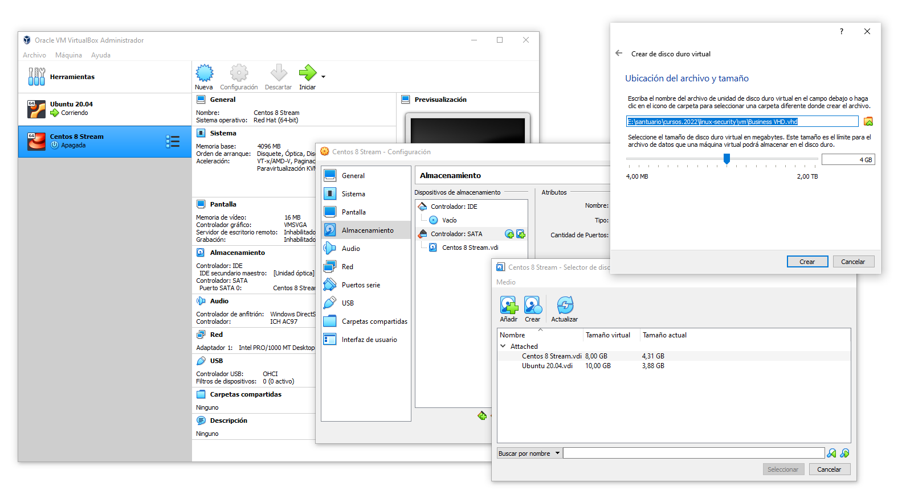
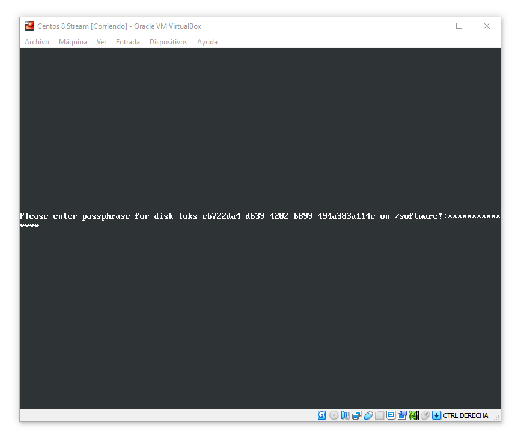
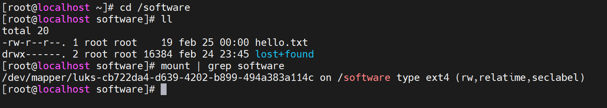

# Sesión 2 - Encriptación y Control de Acceso

## Agenda

* Encriptación y Aseguramiento del SSH 

	- Encriptación de Particiones
	- Encriptación de Directorios
	- Encriptación de Volúmenes
	- Aseguramiento de SSH (sustitución de contraseñas por archivos de claves)

* Control de Acceso a Archivos y Directorios

	- Autoria de archivos y directorios con `chown`
	- Permisos de archivos y directorios con `chmod`

* Listas de Control de Acceso

	- Introducción a las ACL (Access Control Lists)
	- Listas de acceso a usuarios y grupos
	- Listas de acceso heredables en directorios
	- Permisos específicos en la máscara del ACL
	- Directorios compartidos

* Control de Acceso con SELinux

	- Introducción a SELinux
	- Configuración de los contextos de seguridad
	- Políticas de Seguridad de SELinux

## Introducción

Al trabajar con archivos y correos, en ambientes empresariales, será común que deseemos encriptar su información para protegerla. Esta no es una práctica común para un usuario tradicional del sistema. Pero hay escenarios dónde esto deber ser una norma. Por ejemplo, dentro de una empresa es común contar con material propietario de la empresa, correos, archivos, códigos fuentes, directorios y discos duros que necesitan mantenerse cifrados ante cualquier posible robo físico de la información, por ejemplo, que sustraigan algún disco duro durante el matenimiento y lo quieran clonar o acceder a su información.

Para entender mejor la encriptación podemos partir de un mecanismo común disponible tanto en *RHEL/CentOS* y *Debian/Ubuntu* llamado **GPG** (`GNU Privacy Guard`). El cual nos permitirá administrar llaves públicas y privadas, usando diferentes algoritmos bastantes fuertes dentro de la informática.

> Generar las claves principales con `gpg --gen-key`

    [linux]$ gpg --gen-key

    gpg (GnuPG) 2.2.19; Copyright (C) 2019 Free Software Foundation, Inc.
    This is free software: you are free to change and redistribute it.
    There is NO WARRANTY, to the extent permitted by law.

    gpg: directory '/home/ubuntu/.gnupg' created
    gpg: keybox '/home/ubuntu/.gnupg/pubring.kbx' created
    Note: Use "gpg --full-generate-key" for a full featured key generation dialog.

    GnuPG needs to construct a user ID to identify your key.

    Real name: Alan Badillo
    Email address: dragonnomada123@gmail.com
    You selected this USER-ID:
        "Alan Badillo <dragonnomada123@gmail.com>"

    Change (N)ame, (E)mail, or (O)kay/(Q)uit? O
    We need to generate a lot of random bytes. It is a good idea to perform
    some other action (type on the keyboard, move the mouse, utilize the
    disks) during the prime generation; this gives the random number
    generator a better chance to gain enough entropy.
    ...

    # Nota: Usa `gpg --full-generate-key` para mayor especificación.

> Listar las claves generadas

    [linux]$ gpg --list-keys

    gpg: checking the trustdb
    gpg: marginals needed: 3  completes needed: 1  trust model: pgp
    gpg: depth: 0  valid:   1  signed:   0  trust: 0-, 0q, 0n, 0m, 0f, 1u
    gpg: next trustdb check due at 2024-02-25
    /home/ubuntu/.gnupg/pubring.kbx
    -------------------------------
    pub   rsa3072 2022-02-25 [SC] [expires: 2024-02-25]
        F2640CF58167F1FBFBF0BC21577B39E191DFFE58
    uid           [ultimate] Alan Badillo <dragonnomada123@gmail.com>
    sub   rsa3072 2022-02-25 [E] [expires: 2024-02-25]

> Mostrar los archivos de `.gnupg`

    $ ls -l ~/.gnupg

    total 20
    drwx------ 2 ubuntu ubuntu 4096 Feb 25 01:58 openpgp-revocs.d
    drwx------ 2 ubuntu ubuntu 4096 Feb 25 01:58 private-keys-v1.d
    -rw-rw-r-- 1 ubuntu ubuntu 1982 Feb 25 01:58 pubring.kbx
    -rw------- 1 ubuntu ubuntu   32 Feb 25 01:58 pubring.kbx~
    -rw------- 1 ubuntu ubuntu 1280 Feb 25 01:58 trustdb.gpg

> Encriptar un archivo con `gpg -c <path>/<file>`

    [linux]$ gpg -c test.txt

    # Nota: Se creará el archivo encriptado `test.txt.gpg`

> Eliminar repetidamente un archivo con `shred -u -z <file>`

    [linux]$ shred -u -z test.txt

    # Nota: `-u` elimina el archivo y `-z` llena de zeros el registro de reemplazo.

    # Advertencia: El borrado permanente del archivo no dejará huella en los discos duros, por lo que será potencialmente imposible recuperarlo.

> Desencriptar un archivo con `gpg -d <path>/<file>.gpg`

    [linux]$ gpg -d test.txt.gpg > test.txt

    # Nota: Se creará el archivo desencriptado `test.txt`

## Encriptación y Aseguramiento del SSH

### Encriptación de Particiones

Al trabajar en entornos empresariales es común tener distintas particiones y volúmenes, incluso de varios terabytes. Y es importante supervisar y controlar el acceso a los datos dentro de estos volúmenes.

Una forma de conseguir una buena seguridad dentro de volúmenes y particiones es encriptándolos. Para restringir su acceso incluso dentro de la misma empresa. Y así proteger potenciales robos de información.

Un mecanismo común es comenzar a particionar con encriptación. Lo primero es determinar cuáles son los volúmenes y particiones de los que disponemos.

> Listar los volúmenes y particiones con `lsblk`

    [linux]# lsblk

    NAME        MAJ:MIN RM  SIZE RO TYPE MOUNTPOINT
    sda           8:0    0    8G  0 disk
        ├─sda1        8:1    0    1G  0 part /boot
        └─sda2        8:2    0    7G  0 part
        ├─cs-root 253:0    0  6.2G  0 lvm  /
        └─cs-swap 253:1    0  820M  0 lvm  [SWAP]
    sr0          11:0    1 1024M  0 rom

En entornos virtuales como en *Virtual Box* podremos agregar más volúmenes en la configuración de la máquina virtual cómo se muestra en la imagen. Para ello debemos previamente apagar la máquina virtual (puedes usar `shutdown -h 0`).

Una vez creado disco virtual y asociado a la máquina virtual listaremos nuevamente los volúmenes y particiones usando `lsblk`.

    [linux]# lsblk

    NAME        MAJ:MIN RM  SIZE RO TYPE MOUNTPOINT
    sda           8:0    0    8G  0 disk
        ├─sda1        8:1    0    1G  0 part /boot
        └─sda2        8:2    0    7G  0 part
        ├─cs-root 253:0    0  6.2G  0 lvm  /
        └─cs-swap 253:1    0  820M  0 lvm  [SWAP]
    sdb           8:16   0    4G  0 disk
    sr0          11:0    1 1024M  0 rom

Ahora veremos el nuevo volúmen de `4GB` sin particiones.

Procederemos a crear dos particiones dentro del volúmen de `2GB` cada una. Usando `fdisk` podemos de forma interactiva especificar nuevas particiones.

> Crear una nueva partición con `fdisk <volume>`

    [linux]# fdisk /dev/sdb

    Bienvenido a fdisk (util-linux 2.32.1).
    Los cambios solo permanecerán en la memoria, hasta que decida escribirlos.
    Tenga cuidado antes de utilizar la orden de escritura.

    El dispositivo no contiene una tabla de particiones reconocida.
    Se ha creado una nueva etiqueta de disco DOS con el identificador de disco 0x3b1e0e4d.

    Orden (m para obtener ayuda): m

    General
        d   borra una partición
        F   lista el espacio libre no particionado
        l   lista los tipos de particiones conocidos
        n   añade una nueva partición
        p   muestra la tabla de particiones
        t   cambia el tipo de una partición
        v   verifica la tabla de particiones
        i   imprime información sobre una partición

    ...

    Guardar y Salir
        w   escribe la tabla en el disco y sale
        q   sale sin guardar los cambios

    Crea una nueva etiqueta
        g   crea una nueva tabla de particiones GPT vacía
        G   crea una nueva tabla de particiones SGI (IRIX) vacía
        o   crea una nueva tabla de particiones DOS vacía
        s   crea una nueva tabla de particiones Sun vacía

Pulsaremos `m` para obtener el menú de de ayuda. Ahí veremos varias alternativas. Las más importantes son `n` para crear una partición, `p` para ver la tabla de particiones, `g` para crear una tabla de particiones `GPT` y `w` para escribir la tabla de particiones en el disco.

    : p

    Disco /dev/sdb: 4 GiB, 4294967296 bytes, 8388608 sectores
    Unidades: sectores de 1 * 512 = 512 bytes
    Tamaño de sector (lógico/físico): 512 bytes / 512 bytes
    Tamaño de E/S (mínimo/óptimo): 512 bytes / 512 bytes
    Tipo de etiqueta de disco: dos
    Identificador del disco: 0x3b1e0e4d

    : g

    Se ha creado una nueva etiqueta de disco GPT (GUID: 78F8B12A-534E-1042-8648-E8AFFE912204).

    : p

    ...
    Tipo de etiqueta de disco: gpt
    Identificador del disco: 78F8B12A-534E-1042-8648-E8AFFE912204

    : n
    
    Número de partición (1-128, valor predeterminado 1): <<1>>
    Primer sector (2048-8388574, valor predeterminado 2048): <<2048>>
    Último sector, +sectores o +tamaño{K,M,G,T,P} (2048-8388574, valor predeterminado 8388574): <<+2G>>

    Crea una nueva partición 1 de tipo 'Linux filesystem' y de tamaño 2 GiB.

    : p
    
    ...

    Disposit.  Comienzo   Final Sectores Tamaño Tipo
    /dev/sdb1      2048 4196351  4194304     2G Sistema de ficheros de Linux

    : n

    Número de partición (2-128, valor predeterminado 2): <<>>
    Primer sector (4196352-8388574, valor predeterminado 4196352): <<>>
    Último sector, +sectores o +tamaño{K,M,G,T,P} (4196352-8388574, valor predeterminado 8388574): <<>>

    Crea una nueva partición 2 de tipo 'Linux filesystem' y de tamaño 2 GiB.

    : p

    ...

    Disposit.  Comienzo   Final Sectores Tamaño Tipo
    /dev/sdb1      2048 4196351  4194304     2G Sistema de ficheros de Linux
    /dev/sdb2   4196352 8388574  4192223     2G Sistema de ficheros de Linux

Hasta ahora hemos creado una tabla de particiones GPT con dos particiones físicas (`/dev/sdb1` y `/dev/sdb2`) de `2GB` cada una. Podemos verificar que no hay errores con `:v` y el tamaño disponible del volúmen con `:F` (es `0 B`).

Para finalizar escribiremos la tabla de particiones con `:w`, se puede imprimir la información de las particiones con `:i`.

    : i

    Número de partición (1,2, valor predeterminado 2): <<1>>

            Device: /dev/sdb1
            Start: 2048
                End: 4196351
            Sectors: 4194304
            Size: 2G
            Type: Sistema de ficheros de Linux
        Type-UUID: 0FC63DAF-8483-4772-8E79-3D69D8477DE4
            UUID: 9B03BE43-F06A-314C-8574-1CF8029D1E66

    : i

    Número de partición (1,2, valor predeterminado 2): <<2>>

            Device: /dev/sdb2
            Start: 4196352
                End: 8388574
            Sectors: 4192223
            Size: 2G
            Type: Sistema de ficheros de Linux
        Type-UUID: 0FC63DAF-8483-4772-8E79-3D69D8477DE4
            UUID: 9FF770A1-42A4-2F4E-8736-6BCA5D186BEE

    : w

    Se ha modificado la tabla de particiones.
    Llamando a ioctl() para volver a leer la tabla de particiones.
    Se están sincronizando los discos.

Si ahora volvemos a `fdisk /dev/sdb`, podremos ver que `:p` muestra la tabla de particiones que escribimos.

---

Ahora podemos encriptar nuestras particiones nuevas (`/dev/sdb1` y `/dev/sdb2`).

El formato estandarizado LUKS (*Linux Unified Key Setup*) nos permitirá cifrar las particiones y mantener la compatibilidad con la mayoría de sistemas Linux e inclusive otros. Podemos usar `cryptsetup lucksFormat <patition>` para cifrar nuestras particiones.

> Cifrar una partición con `cryptsetup lucksFormat <partition>`

    [linux]# cryptsetup -v luksFormat /dev/sdb1

    WARNING!
    ========
    Esto sobreescribirá los datos en /dev/sdb1 de forma irrevocable.

    Are you sure? (Type 'yes' in capital letters): <<YES>>
    Introduzca la frase contraseña de /dev/sdb1: <<****>>
    Verifique la frase contraseña: <<****>>
    Ranura de claves 0 creada.
    Orden ejecutada correctamente.

Después de confirmar y establecer la contraseña la partición quedará cifrada. Repetiremos para `/dev/sdb2`. La opción `-v` muestra la información detallada y `-y` podrá confirmar automáticamente para no escribir `YES`.

* **Nota:** Si la contraseña no cumple los criterios suficientes, el cifrado no se realizará. Según el tamaño de la partición, esta podría tardar algún tiempo en completarse.

Para verificar la información de encriptación de la partición podremo usar `cryptsetup lucksDump <partition>`.

> Verificar el cifrado de una partición con `cryptsetup lucksDump <partition>`

    [linux]# cryptsetup luksDump /dev/sdb1

    LUKS header information
    Version:        2
    Epoch:          3
    Metadata area:  16384 [bytes]
    Keyslots area:  16744448 [bytes]
    UUID:           cb722da4-d639-4202-b899-494a383a114c
    Label:          (no label)
    Subsystem:      (no subsystem)
    Flags:          (no flags)

    ...

Ahora podemos abrir una partición bajo algún nombre asignado mediante `cryptsetup luksOpen <partition> <name>` (nos solicitará la contraseña de cifrado). Esta será ubicada como un enlace simbólico en `/dev/mapper`.

> Abrir una partición cifrada con 

    [linux]# cryptsetup luksOpen /dev/sdb1 software

    >>> Introduzca la frase contraseña de /dev/sdb1: <<****>>

    # Visualizamos los enlaces dinámicos generados en /dev/mapper

    [linux]# ll /dev/mapper/

    total 0
    crw-------. 1 root root 10, 236 feb 24 22:41 control
    lrwxrwxrwx. 1 root root       7 feb 24 22:41 cs-root -> ../dm-0
    lrwxrwxrwx. 1 root root       7 feb 24 22:41 cs-swap -> ../dm-1
    lrwxrwxrwx. 1 root root       7 feb 24 23:34 software -> ../dm-2

En este caso se asignó `/dev/dm-2` como objetivo aunque podremos referirnos a `/dev/mapper/software`. Podemos también ver la información de nuestra partición descifrada con `dmsetup info <name>`.

> Ver la información de una partición descifrada con `dmsetup info <name>`

    [linux]# dmsetup info software

    Name:              software
    State:             ACTIVE
    Read Ahead:        8192
    Tables present:    LIVE
    Open count:        0
    Event number:      0
    Major, minor:      253, 2
    Number of targets: 1
    UUID: CRYPT-LUKS2-cb722da4d6394202b899494a383a114c-software

Ahora podemos formatear la partición y crear un sistema de archivos. Existen diversos sistemas de archivos populares en linux como XFS y EXT4. Podemos usar `mkfs.xfs` o `mkfs.ext4` para formatear la partición usando alguno de esos sistemas de archivos. Al formatear no debemos olvidar usar `/dev/mapper/<name>` y no `/dev/<partition>` ya que esta última es la cifrada.

> Formatear la partición con `mkfs.ext4 <partition>`

    [linux]# mkfs.ext4 /dev/mapper/software

    mke2fs 1.45.6 (20-Mar-2020)
    Se está creando un sistema de ficheros con 520192 bloques de 4k y 130048 nodos-i
    UUID del sistema de ficheros: 72cc7edb-6bd8-4d83-a069-1983b28465b9
    Respaldos del superbloque guardados en los bloques:
            32768, 98304, 163840, 229376, 294912

    Reservando las tablas de grupo: hecho
    Escribiendo las tablas de nodos-i: hecho
    Creando el fichero de transacciones (8192 bloques): hecho
    Escribiendo superbloques y la información contable del sistema de ficheros: hecho

---

Finalmente, para poder usar las particiones debemos montarlas en alguna carpeta del sistema. Lo más recomendable es montarlas en carpetas específicas que no interfieran con otras carpetas del sistama, por ejemplo `/<name>` con referencia a la partición `<name>` que estemos usando.

> Montar la partición con `mount <partition> <destination>`

    [linux]# mount /dev/mapper/software /software

    # Nota: Crea previamente la carpeta `/software` con `mkdir /software`.

Ahora ya estamos listos para escribir archivos y utilizar nuestra partición. Para el sistema será transparente usar la carpeta `/<name>` cómo una más de las disponibles en el sistema, pero internamente sabremos que todo estará cifrado en esa partición y será segura utilizarla.

* **Nota:** Para desmontar la partición usaremos `umount <destination>` sólo indicando el destino dónde fue montada nuestra partición. Si listamos los archivos se encontrará una carpeta llamada `lost+found` (con esto reconoceremos que es una partición de otro volúmen). También podemos usar `mount | grep <name>` para ver la información de montado de nuestra partición.

---

Montar las particiones de forma manual no es una buena práctica, ya que podríamos olvidar hacerlo o forzarnos a hacerlo tras un reinicio. Por lo que podemos montar las particiones automáticamente mediante la configuración de `/etc/crypttab` y `/etc/fstab`.

El primer paso será ubicar el UUID de la partción mediante `cryptsetup luksUUID <partition>`

> Consultar el UUID de la partición con `cryptsetup luksUUID <partition>`

    [linux]# cryptsetup luksUUID /dev/sdb1

    >>> cb722da4-d639-4202-b899-494a383a114c

Ahora debemos editar a `/etc/crypttab`. Para cada partición deberemos agregar `luks-<UUID> UUID=<UUID> none`, donde `<UUID>` es el UUID de nuestra partición. También hay que observar que `none` nos solicitará la contraseña tras cada reinicio.

> Editar a `/etc/crypttab`

    [linux]# nano /etc/crypttab

    luks-cb722da4-d639-4202-b899-494a383a114c UUID=cb722da4-d639-4202-b899-494a383a114c none

Ahora procedemos a editar a `/etc/fstab` y agregar `/dev/mapper/luks-<UUID> <destination> <filesystem> defaults 0 0`, donde `<UUID>` es el UUID de nuestra partición. En este caso debemos recordar que `<filesystem>` se refiere al sistema de archivos de la partición, para estas notas `ext4`.

> Editar a `/etc/fstab`

    [linux]# nano /etc/crypttab

    ...
    /dev/mapper/cs-swap     none                    swap    defaults        0 0
    /dev/mapper/luks-cb722da4-d639-4202-b899-494a383a114c /software ext4 defaults 0 0

* **Nota:** Podemos reiniciar mediante `shutdown -r 0`

Finalmente, tras reiniciar veremos que se nos solicita la contraseña de la partición. Esto puede evitarse usando un archivo de claves. Pero esa configuración escapa de estas notas.

Una vez adentro podremos ver que nuestra partición fue montada correctamente en `<destination>` (`/software`).

### Encriptación de Directorios

Para la encriptación de directorios podemos usar `eCryptfs`, la cual está disponible para *Debian/Ubuntu*, pero fue removida de *RHEL/CentOS* a partir de la versión `7`.

El cifrado de directorios se dará a través del montaje de un directorio sobre su misma ruta, usando el sistema de archivos `ecryptfs`. Usaremos `mount -t ecryptfs <path> <path>` para conseguirlo. 

Todos los archivos generados mientras la carpeta esté montada de forma cifrada podrán leerse y escribirse sin mayor problema. Sin embargo, si la carpeta se encuentra demostrada, los archivos estarán cifrados.

Esto es muy útil cuándo compartimos volúmenes/particiones o directorios en los que necesitamos mantener todos los archivos de un directorio de forma cifrada. Por ejemplo, dentro de una empresa podría ser una carpeta con los códigos fuente o los reportes financieros.

En *Debian/Ubuntu* instalaremos el paquete `ecryptfs-utils` para utilizarlo.

[UBUNTU]

    sudo apt install ecryptfs-utils

Como en *RHEL/CentOS* no disponemos de `eCryptfs`, podemos intentar instalar manualmente los paquetes usando `dnf install <package>`, pero previamente descargaremos los RPM necesarios para que los reconozca `dnf` (`Dandified YUM`).

* **Nota:** No hay garantías que funcione, pero puede intentarse.

[CENTOS]

    [rhel]# wget https://download-ib01.fedoraproject.org/pub/epel/8/Everything/x86_64/Packages/e/epel-release-8-14.el8.noarch.rpm

    [rhel]# rpm -Uvh epel-release*rpm

    [rhel]# dnf install pkcs11-helper

    [rhel]# wget http://mirror.rackspace.com/elrepo/elrepo/el8/x86_64/RPMS/elrepo-release-8.2-1.el8.elrepo.noarch.rpm

    [rhel]# rpm -Uvh elrepo-release*rpm

    [rhel]# dnf install ecryptfs-utils

Una vez asegurado `eCryptfs` en el sistema podemos montar directorios, pero antes deberemos configurar la frase de montado.

> Generar una contraseña de montado de `eCrypt`

    [ubuntu]$ ecryptfs-setup-private

    Enter your login passphrase [ubuntu]: <<~~~~>>
    Enter your mount passphrase [leave blank to generate one]: <<****>>
    Enter your mount passphrase (again): <<****>>

    ************************************************************************
    YOU SHOULD RECORD YOUR MOUNT PASSPHRASE AND STORE IT IN A SAFE LOCATION.
    ecryptfs-unwrap-passphrase ~/.ecryptfs/wrapped-passphrase
    THIS WILL BE REQUIRED IF YOU NEED TO RECOVER YOUR DATA AT A LATER TIME.
    ************************************************************************

    Done configuring.

    Testing mount/write/umount/read...
    Inserted auth tok with sig [26270991e350d295] into the user session keyring
    Inserted auth tok with sig [f9257081132b6f12] into the user session keyring
    Inserted auth tok with sig [26270991e350d295] into the user session keyring
    Inserted auth tok with sig [f9257081132b6f12] into the user session keyring
    Testing succeeded.

    Logout, and log back in to begin using your encrypted directory.

* **Nota:** Podemos usar `ecryptfs-unwrap-passphrase ~/.ecryptfs/wrapped-passphrase` para recuperar nuestra frase montado.

Ya podemos montar la carpeta mediante `mount -t ecryptfs <path> <path>`

> Montar una carpeta en forma cifrada con `eCrypt`

    [ubuntu]$ sudo mount -t ecryptfs /secret /secret

    Passphrase: <<****>>
    Select cipher:
        1) aes: blocksize = 16; min keysize = 16; max keysize = 32
        2) blowfish: blocksize = 8; min keysize = 16; max keysize = 56
        3) des3_ede: blocksize = 8; min keysize = 24; max keysize = 24
        4) twofish: blocksize = 16; min keysize = 16; max keysize = 32
        5) cast6: blocksize = 16; min keysize = 16; max keysize = 32
        6) cast5: blocksize = 8; min keysize = 5; max keysize = 16
    Selection [aes]: <<>>
    Select key bytes:
        1) 16
        2) 32
        3) 24
    Selection [16]: <<>>
    Enable plaintext passthrough (y/n) [n]: <<>>
    Enable filename encryption (y/n) [n]: <<y>>
    Filename Encryption Key (FNEK) Signature [a48d5eecd5bd6b96]:
    Attempting to mount with the following options:
        ecryptfs_unlink_sigs
        ecryptfs_fnek_sig=a48d5eecd5bd6b96
        ecryptfs_key_bytes=16
        ecryptfs_cipher=aes
        ecryptfs_sig=a48d5eecd5bd6b96
    WARNING: Based on the contents of [/root/.ecryptfs/sig-cache.txt],
    it looks like you have never mounted with this key
    before. This could mean that you have typed your
    passphrase wrong.

    Would you like to proceed with the mount (yes/no)? : <<yes>>
    Would you like to append sig [a48d5eecd5bd6b96] to
    [/root/.ecryptfs/sig-cache.txt]
    in order to avoid this warning in the future (yes/no)? : <<yes>>
    Successfully appended new sig to user sig cache file
    Mounted eCryptfs

    # Inspeccionar la ruta montada

    [ubuntu]$ mount | grep secret

    /secret on /secret type ecryptfs (rw,relatime,ecryptfs_fnek_sig=a48d5eecd5bd6b96,ecryptfs_sig=a48d5eecd5bd6b96,ecryptfs_cipher=aes,ecryptfs_key_bytes=16,ecryptfs_unlink_sigs)

* **ADVERTENCIA:** No debes montar la carpeta mientras estás dentro de ella.

Ahora todos los archivos que se creen dentro de la carpeta mientras este montada quedarán cifrados.

> Desmontar la carpeta

    [ubuntu]$ sudo umount /secret

Una vez desmontada los archivos generados quedarán encriptados y su lectura será imposible.

### Encriptación de Volúmenes

`VeraCrypt` es una gran alternativa a las particiones `LUKS` y al cifrado de directorios `eCrypt`. Esta nos permitirá crear volúmenes cifrados compatibles con otros sistemas operativos. Su funcionamiento es bastante sencillo y cómodo y hay alternativas GUI para su uso.

La consola de `veracrypt` nos permitirá crear los volúmenes e interacturar con ellos. Podemos instalarlo desde [https://www.veracrypt.fr/en/Downloads.html](https://www.veracrypt.fr/en/Downloads.html).

> Instalar VeraCrypt

    # Descargar el paquete de VeraCrypt

    [linux]$ wget https://launchpad.net/veracrypt/trunk/1.25.9/+download/veracrypt-1.25.9-setup.tar.bz2

    # Descomprimir el paquete

    [linux]$ tar xvf veracrypt-1.25.9-setup.tar.bz2

    # Ejecutar el instalador de consola x64

    [linux]$ ./veracrypt-1.25.9-setup-console-x64

Ahora ya podemos crear volúmenes y usarlos.

> Crear un nuevo volumen con `veracrypt -c`

    [linux]$ veracrypt -c

    Volume type:
        1) Normal
        2) Hidden
    Select [1]:

    Enter volume path: <</volumes/data.hc>>

    Enter volume size (sizeK/size[M]/sizeG.sizeT/max): <<1G>>

    Encryption Algorithm:
        1) AES
        2) Serpent
        3) Twofish
        4) Camellia
        5) Kuznyechik
        6) AES(Twofish)
        7) AES(Twofish(Serpent))
        8) Camellia(Kuznyechik)
        9) Camellia(Serpent)
        10) Kuznyechik(AES)
        11) Kuznyechik(Serpent(Camellia))
        12) Kuznyechik(Twofish)
        13) Serpent(AES)
        14) Serpent(Twofish(AES))
        15) Twofish(Serpent)
    Select [1]:

    Hash algorithm:
        1) SHA-512
        2) Whirlpool
        3) SHA-256
        4) Streebog
    Select [1]:

    Filesystem:
        1) None
        2) FAT
        3) Linux Ext2
        4) Linux Ext3
        5) Linux Ext4
        6) NTFS
        7) exFAT
        8) Btrfs
    Select [2]: <<5>>

    Enter password: <<****>>
    Re-enter password: <<****>>

    Enter PIM: <<8891>>

    Enter keyfile path [none]:

    Please type at least 320 randomly chosen characters and then press Enter:
    <<...>>

    Done: 100.000%  Speed:  18 MiB/s  Left: 0 s

    The VeraCrypt volume has been successfully created.

Después de crear el volumen seremos capaces de utilizarlo fácilmente mediante `veracrypt <volume> <destination>`, donde `<volume>` es la ruta a nuestro volumen y `<destination>` será el lugar donde se monte.

> Montar un volumen con `veracrypt <volume> <destination>`

    [linux]$ veracrypt /volumes/data.hc /volumes/data

Ahora ya podemos usar el volumen a través de `/volumes/data`. En modo administrador podremos cambiar los permisos para poder utilizarlo libremente.

> Desmontar un volumen con `veracrypt -d <volume>`

    [linux]$ -d veracrypt /volumes/data.hc

### Aseguramiento de SSH (sustitución de contraseñas por archivos de claves)

    TODO

[REFERENCIAS]

* [https://man7.org/linux/man-pages/man5/crypttab.5.html](https://man7.org/linux/man-pages/man5/crypttab.5.html)
* [https://devconnected.com/how-to-create-disk-partitions-on-linux/](https://devconnected.com/how-to-create-disk-partitions-on-linux/)
* [https://www.veracrypt.fr/en/Command%20Line%20Usage.html](https://www.veracrypt.fr/en/Command%20Line%20Usage.html)

## Control de Acceso a Archivos y Directorios

### Autoria de archivos y directorios con `chown`

    TODO

### Permisos de archivos y directorios con `chmod`

    TODO

## Listas de Control de Acceso

### Introducción a las ACL (Access Control Lists)

    TODO

### Listas de acceso a usuarios y grupos

    TODO

### Listas de acceso heredables en directorios

    TODO

### Permisos específicos en la máscara del ACL

    TODO

### Directorios compartidos

    TODO

## Control de Acceso con SELinux

### Introducción a SELinux

    TODO

### Configuración de los contextos de seguridad

    TODO

### Políticas de Seguridad de SELinux

    TODO

---

 Por [Alan Badillo Salas](https://github.com/dragonnomada)

Estudié **Matemáticas Aplicadas** en la Universidad Autónoma Metropolitana, posteriormente realicé una Maestría en **Inteligencia Artificial** en el Instituto Politécnico Nacional.

He impartido cursos de Programación Avanzada en múltiples lenguajes de programación, incluyendo *C/C++, C#, Java, Python, Javascript* y plataformas como *Android, IOS, Xamarin, React, Vue, Angular, Node, Express*. Ciencia de Datos en *Minería de Datos, Visualización de Datos, Aprendizaje Automático y Aprendizaje Profundo*. También sobre *Sistemas de administración basados en Linux, Apache, Nignx* y *Bases de Datos SQL y NoSQL* como MySQL, SQL Server y Mongo. Desde hace 7 años en varios instituciones incluyendo el *IPN-CIC, KMMX, The Inventor's House, Auribox*. Para diversos clientes incluyendo al **INEGI, CFE, PGJ, SEMAR, Universities, Oracle, Intel y Telmex**.