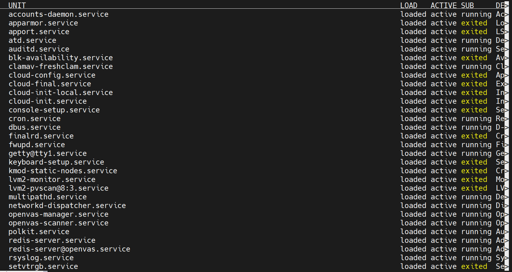
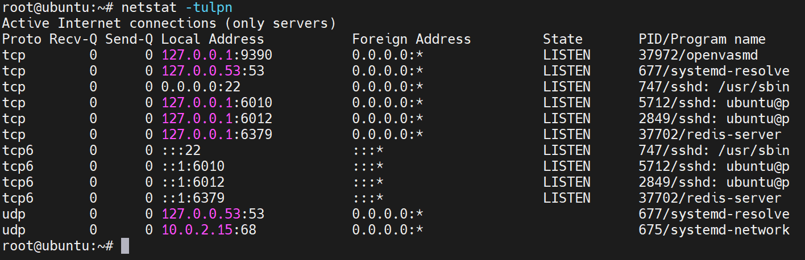
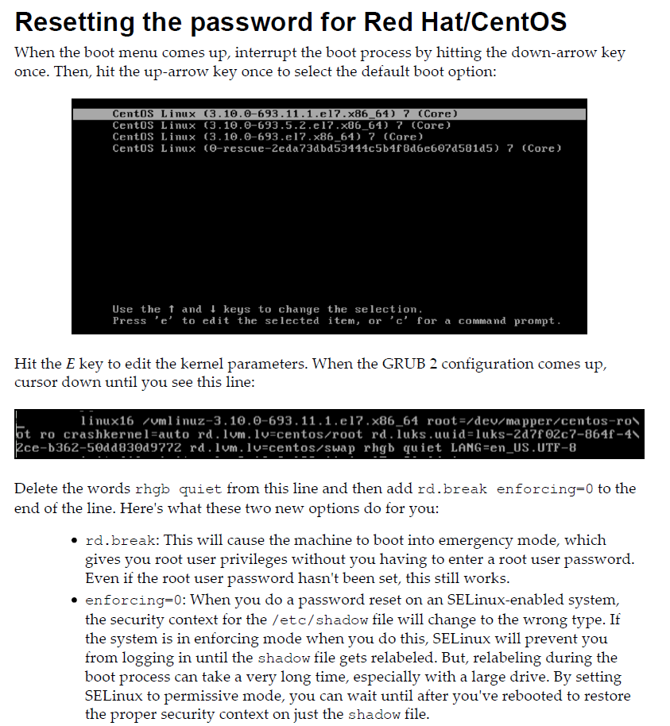
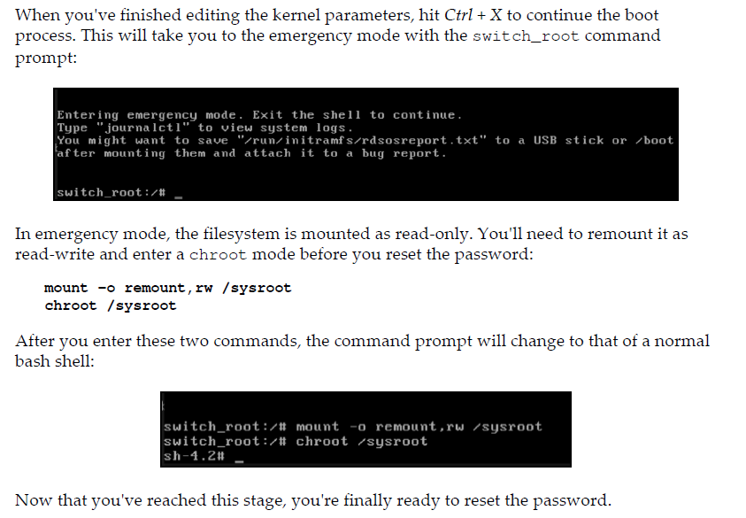
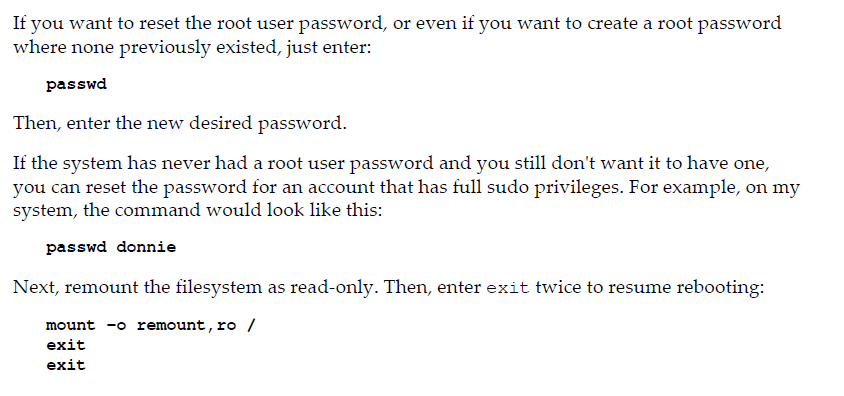
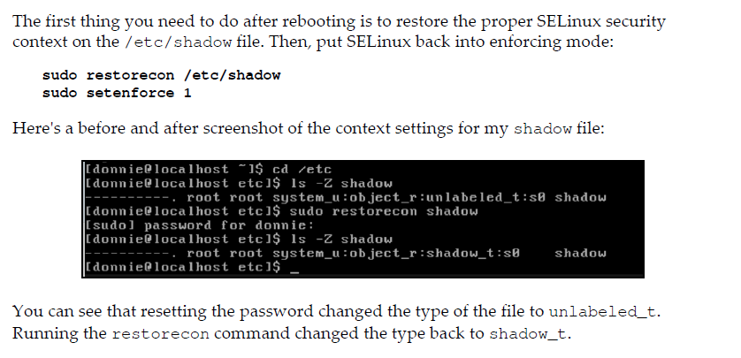
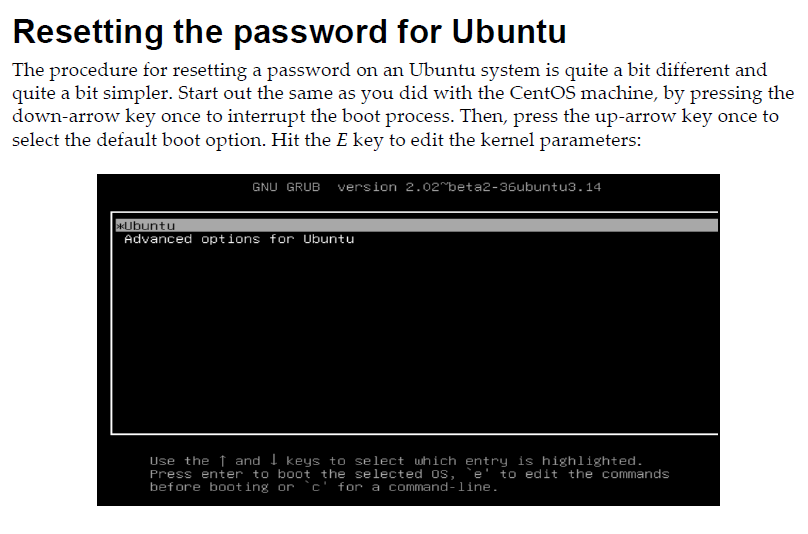
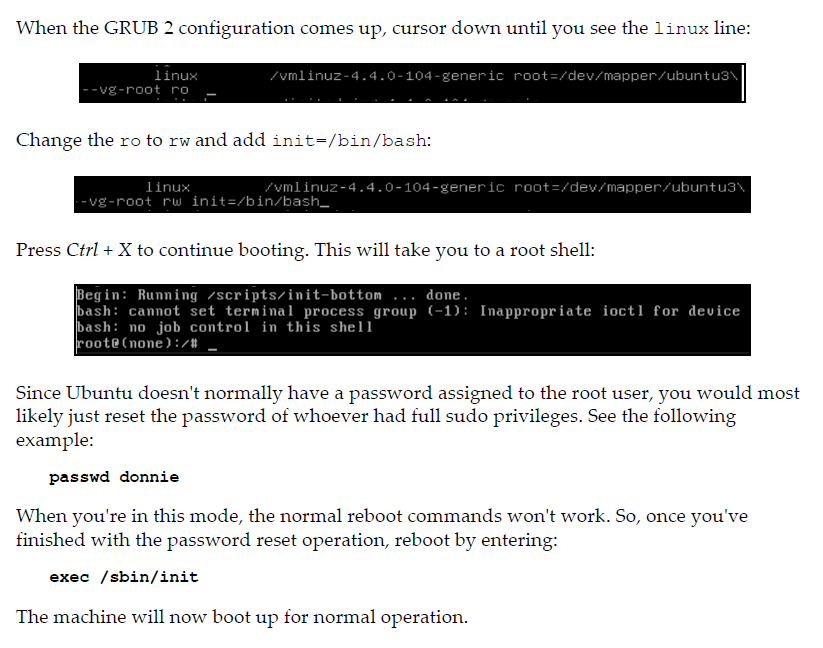

# Sesión 3 - Auditoría y Endurecimiento de la Seguridad

## Agenda

* Auditoría de Seguridad

	- Introducción a ClamAV
	- Auditoría de Archivos
	- Auditoría de Directorios
	- Auditoría de Llamadas del Sistema
	- Búsquedas en cambios de archivos
	- Búsquedas en cambios de directorios
	- Búsquedas en reglas de violación de llamadas del sistema

* Malwares, Vulnerabilidades y Detección de Intrusos

	- Scaneo y uso de Lynis
	- Búsqueda de vulnerabilidades con OpenVAS
	- Escaneo del servidor web con Nikto

* Protocolos Comúnes de Seguridad

	- Auditoría de los servicios del sistema con `systemctl`
	- Auditoría de los servicios de red con `netstat`
	- Auditoría de los servicios de red con `nmap`
	- Reseteo de la contraseña
	- Prevención en la edición de parámetros del kernel

## Introducción

## Auditoría de Seguridad

### Introducción a ClamAV

En Linux podríamos no preocuparnos de los virus, pero no significa que no existan. Sobre todo cuándo no podemos garantizar que los archivos compartidos vengan de fuentes infectadas por archivos de otros sistemas operativos como Windows.

Afortunadamente disponemos de herramientas como *ClamAV*, la cual nos permitirá realizar análisis en busca de *malware* que pueda poner en riesgo el sistema. Esta herramienta nos permitirá usarla en forma tradicional como aplicación, pero también como un servicio continuo.

Partiremos de instalar la herramienta y entender algunos usos principales. En *Debian/Ubuntu* bastará con instalar el paquete `clamav` mediante `apt`. Sin embargo, en *RHEL/CentOS* necesitaremos adicionalmente instalar `clamav-update` para mantener la base de virus actualizada.

[UBUNTU]

> Instalar `ClamAV` en *Debian/Ubuntu*

    [ubuntu]# apt install clamav

[CENTOS]

> Instalar `ClamAV` en *RHEL/CentOS*

    [rhel]# dnf install epel-release -y

    [rhel]# yum install clamav clamav-update -y

> Instalar el servicio `clamd`

    [rhel]# dnf install clamd -y

> Configurar las reglas de SELinux

    [rhel]# setsebool -P antivirus_can_scan_system 1

Ahora podemos actualizar la base de virus con `freshclam`. En *Debian/Ubuntu* necesitaremos detener el servicio previamente.

[UBUNTU]

> Actualizar la última firma de virus con `freshclam` en *Debian/Ubuntu*

    [ubuntu]# systemctl stop clamav-freshclam.service
    
    [ubuntu]# freshclam
    
    [ubuntu]# systemctl start clamav-freshclam.service

[CENTOS]

> Actualizar la última firma de virus con `freshclam` en *RHEL/CentOS*

    [rhel]# freshclam

---

En *RHEL/CentOS* adicionalmente debemos activar el servicio de `freshclam` manualmente para mantenerlo activo.

> Activar el `LockSocket` de `/etc/clamd.d/scan.conf`

    [rhel]# nano /etc/clamd.d/scan.conf

    ...
    # Path to a local socket file the daemon will listen on.
    # Default: disabled (must be specified by a user)
    LocalSocket /run/clamd.scan/clamd.sock
    ...

    # NOTA: Descomenta la línea de LocalSocket para habilitar el demonio.

> Crea el servicio `freshclam.service` en `/usr/lib/systemd/system`

    [rhel]# nano /usr/lib/systemd/system/freshclam.service

    ---
    [Unit]
    Description = ClamAV Scanner
    After = network.target

    [Service]
    Type = forking
    # if you want to scan more than one in a day change the number 1 with your desired number in below line.
    ExecStart = /usr/bin/freshclam -d -c 1
    Restart = on-failure
    PrivateTmp =true

    [Install]
    WantedBy=multi-user.target
    ---

> Inicializa y activa los servicios `clamd@scan` y `freshclam`

    [rhel]# systemctl start clamd@scan

    [rhel]# systemctl start freshclam

    [rhel]# systemctl enable clamd@scan

    >>> Created symlink /etc/systemd/system/multi-user.target.wants/clamd@scan.service → /usr/lib/systemd/system/clamd@.service.

    [rhel]# systemctl enable freshclam

    >>> Created symlink /etc/systemd/system/multi-user.target.wants/freshclam.service → /usr/lib/systemd/system/freshclam.service.

> Comprueba que los servicios  `clamd@scan` y `freshclam` funcionen correctamente

    [rhel]# systemctl status clamd@scan

    ● clamd@scan.service - clamd scanner (scan) daemon
    Loaded: loaded (/usr/lib/systemd/system/clamd@.service; enabled; vendor preset: disabled)
    Active: active (running) since Wed 2022-03-02 00:43:39 EST; 1min 9s ago
        Docs: man:clamd(8)
            man:clamd.conf(5)
            https://www.clamav.net/documents/
    Main PID: 2657 (clamd)
        Tasks: 2 (limit: 11351)
    Memory: 1.1G
    CGroup: /system.slice/system-clamd.slice/clamd@scan.service
            └─2657 /usr/sbin/clamd -c /etc/clamd.d/scan.conf

    mar 02 00:43:39 rhel clamd[2657]: ELF support enabled.
    mar 02 00:43:39 rhel clamd[2657]: Mail files support enabled.
    mar 02 00:43:39 rhel clamd[2657]: OLE2 support enabled.
    mar 02 00:43:39 rhel clamd[2657]: PDF support enabled.
    mar 02 00:43:39 rhel clamd[2657]: SWF support enabled.
    mar 02 00:43:39 rhel clamd[2657]: HTML support enabled.
    mar 02 00:43:39 rhel clamd[2657]: XMLDOCS support enabled.
    mar 02 00:43:39 rhel clamd[2657]: HWP3 support enabled.
    mar 02 00:43:39 rhel clamd[2657]: Self checking every 600 seconds.
    mar 02 00:43:39 rhel systemd[1]: Started clamd scanner (scan) daemon.

    [rhel]# systemctl status freshclam

    ● freshclam.service - ClamAV Scanner
    Loaded: loaded (/usr/lib/systemd/system/freshclam.service; enabled; vendor preset: disabled)
    Active: active (running) since Wed 2022-03-02 00:43:57 EST; 1min 31s ago
    Main PID: 2663 (freshclam)
        Tasks: 1 (limit: 11351)
    Memory: 9.0M
    CGroup: /system.slice/freshclam.service
            └─2663 /usr/bin/freshclam -d -c 1

    mar 02 00:43:56 rhel systemd[1]: Starting ClamAV Scanner...
    mar 02 00:43:57 rhel systemd[1]: Started ClamAV Scanner.

En *Debian/Ubuntu* comprobaremos solamente el servicio `clamav-freshclam`

[UBUNTU]

> Comprobar que el servicio `clamav-freshclam` funcione correctamente

    [ubuntu]# systemctl status clamav-freshclam

    ● clamav-freshclam.service - ClamAV virus database updater
        Loaded: loaded (/lib/systemd/system/clamav-freshclam.service; enabled; vendor preset: enabled)
        Active: active (running) since Wed 2022-03-02 05:30:53 UTC; 15min ago
        Docs: man:freshclam(1)
                man:freshclam.conf(5)
                https://docs.clamav.net/
    Main PID: 4727 (freshclam)
        Tasks: 1 (limit: 2274)
        Memory: 2.0M
        CGroup: /system.slice/clamav-freshclam.service
                └─4727 /usr/bin/freshclam -d --foreground=true

    mar 02 05:30:53 ubuntu systemd[1]: Started ClamAV virus database updater.
    mar 02 05:30:53 ubuntu freshclam[4727]: Wed Mar  2 05:30:53 2022 -> ClamAV update process started at Wed Mar  2 05:3>
    mar 02 05:30:53 ubuntu freshclam[4727]: Wed Mar  2 05:30:53 2022 -> daily.cvd database is up-to-date (version: 26468>
    mar 02 05:30:53 ubuntu freshclam[4727]: Wed Mar  2 05:30:53 2022 -> main.cvd database is up-to-date (version: 62, si>
    mar 02 05:30:53 ubuntu freshclam[4727]: Wed Mar  2 05:30:53 2022 -> bytecode.cvd database is up-to-date (version: 33

---

Ahora ya podemos realizar escaneos en busca de virus, incluso podríamos generar algún script que ejecute los escaneos de forma periódica o basados en alguna regla, como escanear archivos nuevos, copiados, movidos o modificados.

> Realizar un escaneo con `clamscan`

    SINTAXIS: clamscan [options] <path>

    # Opciones:
    # --infected   - Detectar archivos infectados
    # --recursive  - Hacerlor rescusivamente en subcarpetas
    # --remove     - Quitar automáticamente archivos infectados

    EJEMPLO:

    [linux]# clamscan --infected --recursive /marketing-shared

    ----------- SCAN SUMMARY -----------
    Known viruses: 8607123
    Engine version: 0.103.5
    Scanned directories: 1
    Scanned files: 5
    Infected files: 0
    Data scanned: 0.02 MB
    Data read: 0.01 MB (ratio 2.00:1)
    Time: 28.203 sec (0 m 28 s)
    Start Date: 2022:03:02 05:52:58
    End Date:   2022:03:02 05:53:27

[REFERENCIAS]

* [https://unixcop.com/install-clamav-on-centos-8/](https://unixcop.com/install-clamav-on-centos-8/)
*[https://linuxhint.com/install_clamav_ubuntu/](https://linuxhint.com/install_clamav_ubuntu/)

### Auditoría de Archivos

Una forma de auditar los cambios que han ocurrido en los archivos es mediante `auditd`, la cuál nos permitirá obtener un reporte indicando los cambios realizados en los archivos objetivo que deseemos controlar. La audición consistirá en saber que usuario realizó que operaciones sobre nuestros archivos.

En *Debian/Ubuntu* lo primero será instalar `auditd`. En *RHEL/CentOS* ya se encontrará activo por defecto.

[UBUNTU]

> Instalar `auditd` en *Debian/Ubuntu*

    [ubuntu]# apt install auditd -y

Ahora podemos comprobar el estado del servicio de auditoría `auditd`.

> Comprobar el estado del servicio de auditoría `auditd`

    [linux]# systemctl status auditd

    ● auditd.service - Security Auditing Service
    Loaded: loaded (/usr/lib/systemd/system/auditd.service; enabled; vendor preset: enabled)
    Active: active (running) since Tue 2022-03-01 13:46:34 EST; 11h ago
        Docs: man:auditd(8)
            https://github.com/linux-audit/audit-documentation
    Main PID: 730 (auditd)
        Tasks: 4 (limit: 11351)
    Memory: 3.0M
    CGroup: /system.slice/auditd.service
            ├─730 /sbin/auditd
            └─732 /usr/sbin/sedispatch

    mar 01 13:46:34 linux augenrules[745]: enabled 1
    mar 01 13:46:34 linux augenrules[745]: failure 1
    mar 01 13:46:34 linux augenrules[745]: pid 730
    mar 01 13:46:34 linux augenrules[745]: rate_limit 0
    mar 01 13:46:34 linux augenrules[745]: backlog_limit 8192
    mar 01 13:46:34 linux augenrules[745]: lost 0
    mar 01 13:46:34 linux augenrules[745]: backlog 4
    mar 01 13:46:34 linux augenrules[745]: backlog_wait_time 60000
    mar 01 13:46:34 linux augenrules[745]: backlog_wait_time_actual 0
    mar 01 13:46:34 linux systemd[1]: Started Security Auditing Service.

---

Si el servicio de auditoría `auditd` funciona correctamente, podremos insertar nuestras reglas de auditoría en `/etc/audit/rules.d/audit.rules`

> Insertar nuevas reglas de auditoría de `auditd`

    [linux]# nano /etc/audit/rules.d/audit.rules

    ...
    # TODO: Inserta las reglas aquí
    # EJEMPLO: Buscar cambios en el archivo `/etc/passwd`
    # -w /etc/passwd -p wa -k passwd_changes
    ...

Podemos observar una regla de ejemplo `-w /etc/passwd -p wa -k passwd_changes` que se refiere a lo siguiente:

* `-w /etc/passwd`    - Define el archivo objetivo (`-w` *where/donde*).
* `-p wa`             - Se refiere a auditar los cambios (`-p` *permission/permisos*) de escritura (`w`) o cambio de atributos (`a`). Podemos auditar también lectura (`r`) y ejecución (`x`)
* `-k passwd_changes` - Define la clave de audición (`-k` *key/clave*) que se asignará a la audición.

Cada que modifiquemos el archivo, deberemos reiniciar el servicio de audición mediante `systemctl restart auditd`.

> Reinciar el servicio de auditoría `auditd` para aplicar las nuevas reglas

    [linux]# # systemctl restart auditd

Para ver las reglas activas podremos usar `auditctl -l` para listar las reglas activas.

> Ver las reglas de audición activas

    [linux]# auditctl -l

    >>> -w /etc/passwd -p wa -k passwd_changes

Ahora cada que se hagan modificaciones al archivo `passwd` serán registradas en el archivo de log `/var/log/audit/audit.log`.

> Modificar el archivo `/etc/passwd` a través de `passwd`

    [linux]# passwd ana
    New password: <<****>>
    Retype new password: <<****>>

> Ver el log de auditoría de `auditd`

    [linux]# cat /var/log/audit/audit.log
    
    ...
    type=USER_CHAUTHTOK msg=audit(1646202164.027:53): pid=5302 uid=0 auid=1000 ses=8 msg='op=PAM:chauthtok grantors=pam_permit acct="ana" exe="/usr/bin/passwd" hostname=ubuntu addr=? terminal=pts/2 res=success'

Una forma más práctica de revisar una auditoría de `auditd` es a través de `ausearch`.

> Revisar la auditoría mediante `ausearch` sobre una clave de auditoría

    [linux]# # ausearch -i -k passwd_changes

    ----
    type=CONFIG_CHANGE msg=audit(02/03/22 06:19:20.051:51) : auid=unset ses=unset op=add_rule key=passwd_changes list=exit res=yes

> Revisar la auditoría mediante `ausearch` sobre una clave de auditoría

    [linux]# ausearch -i -k passwd_changes

    ----
    type=CONFIG_CHANGE msg=audit(02/03/22 06:19:20.051:51) : auid=unset ses=unset op=add_rule key=passwd_changes list=exit res=yes

> Revisar la auditoría mediante `aureport` sobre una clave de auditoría

    [linux]# aureport -i -k | grep 'passwd_changes'

    1. 02/03/22 06:19:20 passwd_changes yes ? unset 51
    2. 02/03/22 06:33:34 passwd_changes yes /usr/sbin/auditctl unset 106
    3. 02/03/22 06:33:34 passwd_changes yes ? unset 110

---

Veamos un ejemplo más realista. Supongamos que queremos inspeccionar el archivo `/marketing-shared/ana.txt`.

> 1. Establecer la regla objetivo para el archivo en `/etc/audit/rules.d/audit.rules`

    [linux]# nano /etc/audit/rules.d/audit.rules

    ...
    # Audición `ana_txt`
    -w /marketing-shared/ana.txt -p rwxa -k ana_txt
    ...

> 2. Reinciar el servicio de auditoría

    [linux]# systemctl restart auditd

> 3. Revisar las reglas activas

    [linux]# auditctl -l
    
    -w /etc/passwd -p wa -k passwd_changes
    -w /marketing-shared/ana.txt -p rwxa -k ana_txt

> 4. Iniciar sesión con el usuario `ana` y aplicarle algún cambio al archivo

    [linux]$ su - ana

    [linux]$ cd /marketing-shared

    [linux /marketing-shared]$ echo "ok" >> ana.txt

> 5. Revisar la auditoría sobre el log `/var/log/audit/audit.log`

    [linux]# cat /var/log/audit/audit.log

    type=USER_START msg=audit(1646202821.319:116): pid=5798 uid=1000 auid=1000 ses=23 msg='op=PAM:session_open grantors=pam_keyinit,pam_env,pam_env,pam_mail,pam_limits,pam_permit,pam_umask,pam_unix,pam_systemd,pam_ecryptfs acct="ana" exe="/usr/bin/su" hostname=ubuntu addr=? terminal=pts/0 res=success'
    type=SYSCALL msg=audit(1646202832.463:117): arch=c000003e syscall=257 success=yes exit=3 a0=ffffff9c a1=55f815a68480 a2=441 a3=1b6 items=2 ppid=5798 pid=5799 auid=1000 uid=1002 gid=1004 euid=1002 suid=1002 fsuid=1002 egid=1004 sgid=1004 fsgid=1004 tty=pts0 ses=23 comm="bash" exe="/usr/bin/bash" key="ana_txt"
    type=CWD msg=audit(1646202832.463:117): cwd="/marketing-shared"
    type=PATH msg=audit(1646202832.463:117): item=0 name="/marketing-shared" inode=398969 dev=fd:00 mode=043070 ouid=65534 ogid=1002 rdev=00:00 nametype=PARENT cap_fp=0 cap_fi=0 cap_fe=0 cap_fver=0 cap_frootid=0
    type=PATH msg=audit(1646202832.463:117): item=1 name="ana.txt" inode=398984 dev=fd:00 mode=0100664 ouid=1002 ogid=1004 rdev=00:00 nametype=NORMAL cap_fp=0 cap_fi=0 cap_fe=0 cap_fver=0 cap_frootid=0
    type=PROCTITLE msg=audit(1646202832.463:117): proctitle="-bash"

> 6. Revisar la auditoría con `ausearch` para la clave `ana_txt`

    [linux]# ausearch -i -k ana_txt

    ...
    ----
    type=PROCTITLE msg=audit(02/03/22 06:33:52.463:117) : proctitle=-bash
    type=PATH msg=audit(02/03/22 06:33:52.463:117) : item=1 name=ana.txt inode=398984 dev=fd:00 mode=file,664 ouid=ana ogid=ana rdev=00:00 nametype=NORMAL cap_fp=none cap_fi=none cap_fe=0 cap_fver=0 cap_frootid=0
    type=PATH msg=audit(02/03/22 06:33:52.463:117) : item=0 name=/marketing-shared inode=398969 dev=fd:00 mode=dir,sgid,sticky,070 ouid=nobody ogid=marketing rdev=00:00 nametype=PARENT cap_fp=none cap_fi=none cap_fe=0 cap_fver=0 cap_frootid=0
    type=CWD msg=audit(02/03/22 06:33:52.463:117) : cwd=/marketing-shared
    type=SYSCALL msg=audit(02/03/22 06:33:52.463:117) : arch=x86_64 syscall=openat success=yes exit=3 a0=0xffffff9c a1=0x55f815a68480 a2=O_WRONLY|O_CREAT|O_APPEND a3=0x1b6 items=2 ppid=5798 pid=5799 auid=ubuntu uid=ana gid=ana euid=ana suid=ana fsuid=ana egid=ana sgid=ana fsgid=ana tty=pts0 ses=23 comm=bash exe=/usr/bin/bash key=ana_txt

> 7. Revisar la auditoría con `aureport` para la clave `ana_txt`

    [linux]# aureport -i -k | grep 'ana_txt'

    4. 02/03/22 06:33:34 ana_txt yes /usr/sbin/auditctl unset 111
    5. 02/03/22 06:33:52 ana_txt yes /usr/bin/bash ubuntu 117

### Auditoría de Directorios

Aplicar reglas de auditoría a nivel archivo no es práctico. Sin embargo, hacerlo a nivel directorio si lo es.

Podemos generar una clave de auditoría sobre el directorio fácilmente estableciendo la regla `-w` hacía la carpeta y `-k` como la clave de la regla.

> Establecer la regla objetivo para el archivo en `/etc/audit/rules.d/audit.rules`

    [linux]# nano /etc/audit/rules.d/audit.rules

    ...
    -w /marketing-shared/ -p rwxa -k marketing_shared_changes
    ...

Ahora los cambios realizados en la carpeta serán auditados, y podremos consultarlos en el log de `auditd` o mediante `ausearch` y `aureport`.

### Auditoría de Llamadas del Sistema

También podemos crear auditorías sobre las llamadas al sistema de un usuario específico.

> Establecer la regla objetivo para el archivo en `/etc/audit/rules.d/audit.rules`

    SINTAXIS: -a <action> -F arch=<arch> -S openat -F auid=<uid>

    # Donde:
    # <action> - Son las acciones para ser considerada, generalmente `always,exit`
    # <arch>   - Es la arquitectura de la máquina, generalmente `b64` (significa `x86_64`)
    # <uid>    - Es el ID del usuario (consultado mediante `id <user>`)

    EJEMPLO:

    [linux]# nano /etc/audit/rules.d/audit.rules

    ...
    -a always,exit -F arch=b64 -S openat -F auid=1006
    ...

Ahora, todas las llamadas que realice el usuario con ID `1006` serán auditadas.

* **IMPORTANTE:** Existen un conjunto de reglas prediseñadas disponibles en `/usr/share/doc/auditd/examples/rules/`. Se pueden consultar e integrar a las reglas de `/etc/audit/rules.d` para proveer reglas comúnes utilizadas en seguridad.

### Búsquedas en cambios de archivos

Para poder inspeccionar cambios en archivos cuyo resultado haya sido fallido.

    [REGLA]:    -w <path>/<file> -p rwxa -k <key>

    [BÚSQUEDA]: ausearch -i -k <key> | grep 'success=no'

    [REPORTE]:  aureport -i -k | grep <key>

### Búsquedas en cambios de directorios

Para poder inspeccionar cambios en carpetas cuyo acceso haya sido denegado.

    [REGLA]:    -w <path> -p rwxa -k <key>

    [BÚSQUEDA]: ausearch -i -k <key> | grep 'exit=EACCES'

    [REPORTE]:  aureport -i -k | grep <key>

### Búsquedas en reglas de violación de llamadas del sistema

Para poder inspeccionar cambios en carpetas cuyo acceso haya sido denegado.

    [REGLA]:    -a <action> -F arch=<arch> -S openat -F auid=<uid>

    [BÚSQUEDA]: ausearch -i | grep <uid> | grep 'SYSCALL'

    [REPORTE]:  aureport -s -i | grep 'openat' | grep <uid>

[REFERENCIAS]

* [https://access.redhat.com/documentation/en-us/red_hat_enterprise_linux/8/html/security_hardening/auditing-the-system_security-hardening](https://access.redhat.com/documentation/en-us/red_hat_enterprise_linux/8/html/security_hardening/auditing-the-system_security-hardening)
* [https://www.tecmint.com/create-reports-from-audit-logs-using-aureport-on-centos-rhel/](https://www.tecmint.com/create-reports-from-audit-logs-using-aureport-on-centos-rhel/)

## Malwares, Vulnerabilidades y Detección de Intrusos

### Scaneo y uso de Lynis

**Lynis** es una herramienta gratuita de código abierto que nos permite escanear vulnerabilidades y fallos de seguridad. Podemos instalarla mediante el paquete `lynis`.

[UBUNTU]

> Instalar `lynis`

    [ubuntu]# apt install lynis -y

[CENTOS]

> Instalar `lynis`

    [rhel]# yum install lynis -y

Una vez instalada podemos generar un reporte de vulnerabilidades del sistema mediante `lynis audit system`.

> Detectar vulnerabilidades del sistema

    [linux]# lynis audit system

    [ Lynis 2.6.2 ]

    ################################################################################
    Lynis comes with ABSOLUTELY NO WARRANTY. This is free software, and you are
    welcome to redistribute it under the terms of the GNU General Public License.
    See the LICENSE file for details about using this software.

    2007-2018, CISOfy - https://cisofy.com/lynis/
    Enterprise support available (compliance, plugins, interface and tools)
    ################################################################################

    [+] Initializing program
    ------------------------------------
    - Detecting OS...                                           [ DONE ]
    - Checking profiles...                                      [ DONE ]
    - Detecting language and localization                       [ es ]

    ---------------------------------------------------
    Program version:           2.6.2
    Operating system:          Linux
    Operating system name:     Ubuntu Linux
    Operating system version:  20.04
    Kernel version:            5.4.0
    Hardware platform:         x86_64
    Hostname:                  ubuntu
    ---------------------------------------------------
    Profiles:                  /etc/lynis/default.prf
    Log file:                  /var/log/lynis.log
    Report file:               /var/log/lynis-report.dat
    Report version:            1.0
    Plugin directory:          /etc/lynis/plugins
    ---------------------------------------------------
    Auditor:                   [Not Specified]
    Language:                  es
    Test category:             all
    Test group:                all
    ---------------------------------------------------
    - Program update status...                                  [ WARNING ]

    ...

    [+] Boot and services
    ------------------------------------
    - Service Manager                                           [ DESCONOCIDO ]
    - Checking UEFI boot                                        [ DESACTIVADO ]
    - Checking presence GRUB2                                   [ ENCONTRADO ]
        - Checking for password protection                        [ PELIGRO ]
    - Check running services (systemctl)                        [ HECHO ]
            Result: found 24 running services
    - Check enabled services at boot (systemctl)                [ HECHO ]
            Result: found 62 enabled services
    - Check startup files (permissions)                         [ OK ]
    - Checking sulogin in rescue.service                        [ NO ENCONTRADO ]

    ...

Al final nos mostrará un reporte del endurecimiento de la seguridad encontrado.

    ================================================================================

    Lynis security scan details:

    Hardening index : 53 [##########          ]
    Tests performed : 226
    Plugins enabled : 1

    Components:
    - Firewall               [V]
    - Malware scanner        [V]

    Lynis Modules:
    - Compliance Status      [?]
    - Security Audit         [V]
    - Vulnerability Scan     [V]

    Files:
    - Test and debug information      : /var/log/lynis.log
    - Report data                     : /var/log/lynis-report.dat

    ================================================================================
    Notice: Lynis Actualización disponible
    Versión actual : 262    Latest version : 307
    ================================================================================

    Lynis 2.6.2

    Auditing, system hardening, and compliance for UNIX-based systems
    (Linux, macOS, BSD, and others)

    2007-2018, CISOfy - https://cisofy.com/lynis/
    Enterprise support available (compliance, plugins, interface and tools)

    ================================================================================

### Búsqueda de vulnerabilidades con OpenVAS

Otra herramienta disponible para la detección de vulnerabilidades es **OpenVAS** (*Open Vulnerability Assessment Scanner*). La cuál podremos instalar mediante el paquete `openvas`. Sin embargo, es posible que esta sólo esté disponible para *Debin/Ubuntu*.

[UBUNTU]

> Instalar *OpenVAS*

    [ubuntu]# apt install openvas

* **Nota:** La instalación podría demorar algún tiempo.

Una vez instalada procederemos a configurarla mediante `openvas-setup`.

> Configurar *OpenVAS* con `openvas-setup`

    [ubuntu]# openvas-setup

* **IMPORTANTE:** En este proceso se generá una contraseña que deberemos anotar y guardar.

Una vez configurada, podremos inicializar el servidor web de *OpenVAS*, montado en el pueto `9392`. Considera habilitar el puerto en el `firewall`.

> Inicializar *OpenVAS* en el puerto `9392` por defecto

    [ubuntu]# openvas start

    # Nota: con openvas stop podremos detener el servidor de OpenVAS

* **Nota:** Considera reenviar el puerto `9392` en la máquina virtual.

Ahora podremos ir a en un navegador la ruta `http://localhost:9392` y poner como usuario `admin` y la contraseña generada anteriormente por `openvas-setup`.

### Escaneo del servidor web con Nikto

**Nikto** es una herramienta de propósito específico dedicada a encontrar vulnerabilidades sobre servicios web. Debemos considerar que su instalación dependerá de algunos paquetes adicionales de *PERL*.

[UBUNTU]

> Instalar *Nikto* en *Debian/Ubuntu*

    [ubuntu]# apt install nikto libnet-ssleay-perl

[CENTOS]

> Instalar *Nikto* en *RHEL/CentOS*

    [rhel]# yum install perl-Net-SSLeay -y

    [rhel]# dnf install https://extras.getpagespeed.com/release-latest.rpm -y

    [rhel]# dnf install nikto -y

Ahora podemos actualizar *Nikto* mediante `nikto -update`.

> Actualizar *Nikto*

    [linux]# nikto -update

Para inspeccionar un servidor web usaremos `nikto -h <domain>`

> Inspeccionar un servidor web

    SINTAXIS: nikto -h <domain>

    EJEMPLO:

    [linux]# nikto -h https://google.com

    - Nikto v2.1.5
    ---------------------------------------------------------------------------
    + Target IP:          142.251.35.14
    + Target Hostname:    google.com
    + Target Port:        443
    ---------------------------------------------------------------------------
    + SSL Info:        Subject: /OU=No SNI provided; please fix your client./CN=invalid2.invalid
                    Ciphers: TLS_AES_256_GCM_SHA384
                    Issuer:  /OU=No SNI provided; please fix your client./CN=invalid2.invalid
    + Start Time:         2022-03-02 08:08:04 (GMT0)
    ---------------------------------------------------------------------------
    + Server: gws
    + Uncommon header 'x-frame-options' found, with contents: SAMEORIGIN
    + Uncommon header 'alt-svc' found, with contents: h3=":443"; ma=2592000,h3-29=":443"; ma=2592000,h3-Q050=":443"; ma=2592000,h3-Q046=":443"; ma=2592000,h3-Q043=":443"; ma=2592000,quic=":443"; ma=2592000; v="46,43"
    + Uncommon header 'x-xss-protection' found, with contents: 0
    + Root page / redirects to: https://www.google.com/
    + Uncommon header 'referrer-policy' found, with contents: no-referrer
    + No CGI Directories found (use '-C all' to force check all possible dirs)
    + Server banner has changed from 'gws' to 'sffe' which may suggest a WAF, load balancer or proxy is in place
    + Uncommon header 'cross-origin-resource-policy' found, with contents: cross-origin
    + Uncommon header 'x-content-type-options' found, with contents: nosniff
    + Hostname 'google.com' does not match certificate's CN 'invalid2.invalid'
    + Cookie 1P_JAR created without the secure flag
    + Cookie 1P_JAR created without the httponly flag
    + Cookie NID created without the secure flag
    + Cookie NID created without the httponly flag
    + Allowed HTTP Methods: GET, HEAD
    ...

## Protocolos Comúnes de Seguridad

### Auditoría de los servicios del sistema con `systemctl`

Para determinar los servicios activos que se están ejecutando y se ejecutarán tras el reinicio de la máquina, podemos usar `systemctl` que es el *Controlador de Servicios*.

Esto nos permitirá determinar que servicio están activos, ejecutándose, detenidos, la descripción de ellos y demás información.

> Mostrar los servicios activos con `systemctl`

    [linux]# systemctl -t service --state=active

En la siguiente imagen se muestra el resultado.

Para ver los detalles de un servicio podremos inspeccionar el archivo de extensión `.service` ubicado en `/usr/lib/systemd/system`.

> Ver los detalles de un servicio

    SINTAXIS: cat /usr/lib/systemd/system/<name>.service

    EJEMPLO:

    # cat /usr/lib/systemd/system/clamav-freshclam.service

    [Unit]
    Description=ClamAV virus database updater
    Documentation=man:freshclam(1) man:freshclam.conf(5) https://docs.clamav.net/
    # If user wants it run from cron, don't start the daemon.
    ConditionPathExists=!/etc/cron.d/clamav-freshclam
    Wants=network-online.target
    After=network-online.target

    [Service]
    ExecStart=/usr/bin/freshclam -d --foreground=true
    StandardOutput=syslog

    [Install]
    WantedBy=multi-user.target

### Auditoría de los servicios de red con `netstat`

El comando `netstat` nos permite auditar los puertos y programas que utilizan dichos puertos para garantizar una buena seguridad en la red.

En *Debian/Ubuntu* requeriremos instalar `netstat-tools` para poder utilizarlo. En *RHEL/CentOS* ya estará disponible en junto a la instalación.

[UBUNTU]

> Instalar `netstat-tools` en *Debian/Ubuntu*

    [ubuntu]# apt install net-tools

Una vez instalado podemos inspeccionar la información de red usando `netstat [options]`. Existen múltiples combinaciones de información a mostrar, puedes usar `man netstat` para ver los detalles de las posibles combinaciones.

> Inspeccionar la información de los puertos con `netstat`

    [linux]# netstat -tulpn

    # Ejemplo de otra combinación: `netstat -lpn -A inet`

El resultado de la ejecución se muestra a continuación.

### Auditoría de los servicios de red con `nmap`

El comando `nmap` nos permite hacer un escaneo de la red en busca de paquetes que se estén transfiriendo. Este comando es muy útil para auditar las conexiones a un servidor o al nuestro. En *Debian/Ubuntu* está disponible por defecto. Pero en *RHEL/CentOS* deberemos instalarlo manualmente.

[CENTOS]

> Instalar `nmap` en *RHEL/CentOS*

    [rhel]# yum install nmap

Para detectar paquetes sobre la red, lo más común es usar `<ip>/24` que inspeccionará todas las IPs en busca de paquetes.

> Buscar paquetes con `nmap`

    [linux]# nmap -sS 127.0.0.1/24

    Starting Nmap 7.80 ( https://nmap.org ) at 2022-03-02 08:28 UTC
    Nmap scan report for localhost (127.0.0.0)
    Host is up.
    All 1000 scanned ports on localhost (127.0.0.0) are filtered

    Nmap scan report for localhost (127.0.0.1)
    Host is up (0.000017s latency).
    Not shown: 999 closed ports
    PORT   STATE SERVICE
    22/tcp open  ssh

    Nmap scan report for ubuntu (127.0.0.2)
    Host is up (0.000012s latency).
    Not shown: 999 closed ports
    PORT   STATE SERVICE
    22/tcp open  ssh

    Nmap scan report for localhost (127.0.0.3)
    Host is up (0.000032s latency).
    Not shown: 999 closed ports
    PORT   STATE SERVICE
    22/tcp open  ssh

    ...

Podemos usar algunas otras variantes como `-sA`, `-sU` y demás para auditar cosas distintas.

### Reseteo de la contraseña

Para evitar un reseteo de la contraseña, **es importante que las máquinas estén protegidas mediante el BIOS**. De otra forma se podrán seguir una serie de pasos para conseguir su reseteo.

* **ADVERTENCIA:** Por cuestiones de seguridad, los siguientes pasos se colocan como imagen. 

    **NO USE ESTA INFORMACIÓN CON FINES PERVERSOS, CUALQUIER MAL USO DE ESTA INFORMACIÓN SERÁ SANCIONADA POR LAS LEYES VIGENTES DE MÉXICO Y ESTADOS UNIDOS. EL AUTOR DE ESTAS NOTAS NO SE HACE RESPONSABLE DEL USO QUE SE LE DE A ESTA INFORMACIÓN Y LO HACE CON FINES EDUCATIVOS PARA PERSONAL DE SEGURIDAD ÉTICO**.

[CENTOS]

[UBUNTU]

### Prevención en la edición de parámetros del kernel

Para evitar el cambio de parámetros en el Kernel será importante establecer una contraseña del GRUB 2. Esto lo podemos conseguir con el comando `grub-mkpasswd-pbkdf2`.

> Establecer la seguridad de GRUB

    [linux]# grub-mkpasswd-pbkdf2
    Enter password: <<****>>
    Reenter password: <<****>>

[REFERENCIAS]

* [https://access.redhat.com/documentation/es-es/red_hat_enterprise_linux/8/html/security_hardening/index](https://access.redhat.com/documentation/es-es/red_hat_enterprise_linux/8/html/security_hardening/index)

---

 Por [Alan Badillo Salas](https://github.com/dragonnomada)

Estudié **Matemáticas Aplicadas** en la Universidad Autónoma Metropolitana, posteriormente realicé una Maestría en **Inteligencia Artificial** en el Instituto Politécnico Nacional.

He impartido cursos de Programación Avanzada en múltiples lenguajes de programación, incluyendo *C/C++, C#, Java, Python, Javascript* y plataformas como *Android, IOS, Xamarin, React, Vue, Angular, Node, Express*. Ciencia de Datos en *Minería de Datos, Visualización de Datos, Aprendizaje Automático y Aprendizaje Profundo*. También sobre *Sistemas de administración basados en Linux, Apache, Nignx* y *Bases de Datos SQL y NoSQL* como MySQL, SQL Server y Mongo. Desde hace 7 años en varios instituciones incluyendo el *IPN-CIC, KMMX, The Inventor's House, Auribox*. Para diversos clientes incluyendo al **INEGI, CFE, PGJ, SEMAR, Universities, Oracle, Intel y Telmex**.