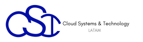

# Linux Security & Server Hacking

---

 Por [Alan Badillo Salas](https://github.com/dragonnomada)

Estudié **Matemáticas Aplicadas** en la Universidad Autónoma Metropolitana, posteriormente realicé una Maestría en **Inteligencia Artificial** en el Instituto Politécnico Nacional.

He impartido cursos de Programación Avanzada en múltiples lenguajes de programación, incluyendo *C/C++, C#, Java, Python, Javascript* y plataformas como *Android, IOS, Xamarin, React, Vue, Angular, Node, Express*. Ciencia de Datos en *Minería de Datos, Visualización de Datos, Aprendizaje Automático y Aprendizaje Profundo*. También sobre *Sistemas de administración basados en Linux, Apache, Nignx* y *Bases de Datos SQL y NoSQL* como MySQL, SQL Server y Mongo. Desde hace 7 años en varios instituciones incluyendo el *IPN-CIC, KMMX, The Inventor's House, Auribox*. Para diversos clientes incluyendo al **INEGI, CFE, PGJ, SEMAR, Universities, Oracle, Intel y Telmex**.

---

## Objetivos

• Definir políticas de seguridad para contraseñas y cuentas de usuarios
• Protección de datos confidenciales con cifrado de Volúmenes de Disco
• Cómo filtrar tráfico en base a protocolos, puertos y direcciones IP
• Mitigar ataques Dos/DDos con reglas IPTables
• Cómo identificar un malware oculto en el sistema
• Accesos físicos y remotos: protección de ataques y autenticación multi-factor
• Auditar cambios en el sistema a través de Kernel

## Contenido

* Linux y entornos virtuales

	- Configuración de un entorno virtual Linux
	- Introducción a RHEL (Red Hat Enterprise Linux)
	- Introducción a Ubuntu
	- Configuración de un Servidor Amazon Linux

* Seguridad en Cuentas de Usuarios y Grupos

	- Usuarios administrativos
	- El grupo predefinido admin
	- El archivo de políticas sudo
	- Usuarios sudo limitados
	- Prevención de ataques de fuerza bruta en contraseñas
	- Bloquear de cuentas de usuarios

* Seguridad del Servidor y el Firewall

	- Introducción a iptables
	- Zonas y servicios
	- Introducción a nftables

* Encriptación y Aseguramiento del SSH 

	- Encriptación de Particiones
	- Encriptación de Directorios
	- Encriptación de Volúmenes
	- Aseguramiento de SSH (sustitución de contraseñas por archivos de claves)

* Control de Acceso a Archivos y Directorios

	- Autoria de archivos y directorios con `chown`
	- Permisos de archivos y directorios con `chmod`

* Listas de Control de Acceso

	- Introducción a las ACL (Access Control Lists)
	- Listas de acceso a usuarios y grupos
	- Listas de acceso heredables en directorios
	- Permisos específicos en la máscara del ACL
	- Directorios compartidos

* Control de Acceso con SELinux

	- Introducción a SELinux
	- Configuración de los contextos de seguridad
	- Políticas de Seguridad de SELinux

* Auditoría de Seguridad

	- Introducción a ClamAV
	- Auditoría de Archivos
	- Auditoría de Directorios
	- Auditoría de Llamadas del Sistema
	- Búsquedas en cambios de archivos
	- Búsquedas en cambios de directorios
	- Búsquedas en reglas de violación de llamadas del sistema

* Malwares, Vulnerabilidades y Detección de Intrusos

	- Scaneo y uso de Lynis
	- Búsqueda de vulnerabilidades con OpenVAS
	- Escaneo del servidor web con Nikto

* Protocolos Comúnes de Seguridad

	- Auditoría de los servicios del sistema con `systemctl`
	- Auditoría de los servicios de red con `netstat`
	- Auditoría de los servicios de red con `nmap`
	- Reseteo de la contraseña
	- Prevención en la edición de parámetros del kernel
